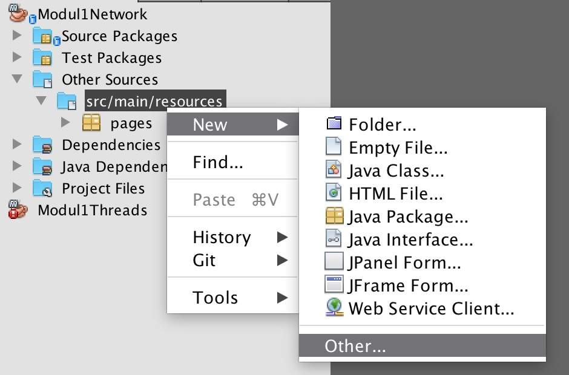
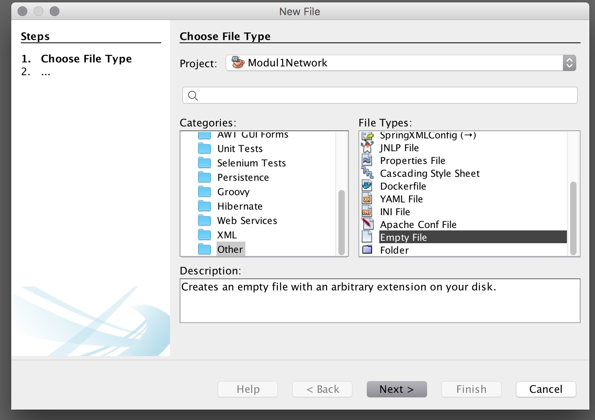

# Netværk

### Læringsmål
Efter første uge er det meningen at:

- at du kan programmere en simpel http server
	- som lytter på en specifik TCP port
	- som kan svare browseren med et http response der enten kan være tekst eller html eller fejlkode.
- at du kan dekode et simpelt http get request
- at du kan sende indholdet fra en HTML fil fra din server til en browser
- du kan åbne din firewall derhjemme sådan at din webserver kan tilgås udefra

#### Erhvervskompetencer
Det forventes af alle programmører at de kender til basale netværks funktioner, og at man ved hvordan http protokollerne virker. Desuden er der i øjeblikket en bevægelse henimod meget mindre webservere som kun er lidt mere komplicerede end dem vi bygger i disse uger.

## Uge 1
Det er meningen I skal arbejde i grupperne med emnerne. Vi mødes mandag, onsdag og fredag. 

### Mandag er vigtig
og vil være "klassisk dag", altså alle tilstæde i klassen med en blanding af oplæg, demo, og øvelser.

Denne dag er semesterets første dag, og vi vil prøve at give det overordnede billede af hvad der kommer til at ske resten af semesteret, og præsentere de tre undervisere I kommer til at arbejde med.

Onsdag og Fredag vil vi mødes i grupperne af gangen  så vi kan følge op på om der er problemer med opgaverne og læsestoffet.

### Læsestof og opgaver til onsdag

- [Note om netværk](NoteNetværkHTTP.md)
- [Link til kode](https://github.com/Dat2SemCPH/Modul1NetworkHTTP)
- [Slides fra mandag](Week1.pptx)

Når vi mødes onsdag vil jeg gerne se jeres løsning på nedenstående opgaver. Alle i gruppen skal have en løsning på sin computer, og **alle skal have sin computer med til feedback** så vi kan snakke om jeres løsning.

### Onsdags review.

1. (Grøn) I skal kunne vise forskellen på hvilken data der sendes til en web server fra henholdsvis en chrome og en firefox browser (prøv gerne med andre browsere også).
2. (Gul) Hvis man starter picoserver02 to gange (uden at lukke det første ned) får man en fejl. Hvad betyder den fejl og hvorfor får man den.
3. (Rød) Prøv vha. exception handling at lave picoserver2 om sådan at den automatisk finder en server socket der ikke er i brug, sådan at I kan have mere end en server kørende på samme tid i Netbeans.
4. Find en person i gruppen der kan lave et wifi-hot-spot med sin telefon, og kopl jeres laptop på denne telefon. 
	* Find IP addressen på laptoppen (hvis I ikke ved hvordan man finder IP addressen på jeres laptop, så er det altså det der er google opgaven). Det er vigtigt at alle i gruppen kan finde deres IP addresse, uanset om det er Windows, Mac, Linux eller noget andet.
	* (grøn)Demonstrer at I kan kople på picoserver2 via jeres telefon.
	* (gul) Kopl alle gruppens laptops på samme telefon, og demonstrer hvordan I fra jeres browser kan kople jer på forskellige servere på andres laptops.
	* (rød) Behøver alle serverne at bruge samme port nummer? Demonstrer hvordan man fra en laptop kan have mere end en server kørende, og tilgå dem fra en anden laptop.
5. (grøn) Er det java eller operativ systemet der har ansvaret for porte, altså er det java eller operativ systemet der brokker sig hvis man prøver at åbne den samme port to gange? Og hvorfor er det et problem med to porte med samme nummer?

9. (rød) Som en del af den udleverede kode er der en klasse der hedder HttpRequest. Redegør for denne klasse, specielt skal I kunne forklare:
	*  Hvad er forskellen på parametre og headers?
	*  Hvad gør de første 7 linjer i konstruktøren?
	*  I konstruktøren er der en linje der hedder:
	`if ("application/x-www-form-urlencoded".equals(getContentType())) {`
	Forklar hvorfor denne er smartere end:

	`if ( getContentType().equals("application/x-www-form-urlencoded" ) ){`

	
### Fredag

1. (grøn) I den løsning der hedder picoserver06 bruges der en konstant der hedder `RES`. Denne opgave går ud på at få denne fil til at være i `resources` kataloget.

	* Lav en fil `result.tmpl`(tmpl for "template") med samme indhold som RES variablen sidst i `ServerMain.java`. Denne fil skal være i `resources`.
		* Hvis I ikke lige ved hvordan man laver en ny tom fil, så kik nederst på denne side
	* I stedet for at bruge `RES` variablen skal man i `addOurNumbers` metoden læse indholdet fra `result.tmpl` filen (husk der er en metode i `ServerMain.java` der kan læse en fil fra resources).
2. (gul) Metoden 'addOurNumbers' gør 3 ting. Den finder de to parametre i HttpRequest, den laver dem om til heltal og lægger dem sammen, og endelig genererer den en ny html side ud fra templaten. Du skal her programmere en metode `String generateHTML(String file, String a, String b, String c)` hvor a, b og c er de værdier der skal sættes ind i filen (på pladserne $0, $1 og $2 - så vi kan generere HTML ud fra en template fil i resource kataloget. Denne metode skal så kaldes fra `addOurNumbers` så addOurNumbers ikke skal læse fil heller ikke lave replace.
3. (rød) Der findes en særlig Java syntaks til at tillade et variabelt antal parametre af samme type. Søg efter "java varargs". Lav en metode `generateHTML` der stadig tager resource fil navn som første argument, men som derefter tager et vilkårligt antal parametre sådan at man kan bruge templates med vilkårligt antal parametre. Husk at filnavn skal indeholde mappenavn, hvis man har lagt den i en undermappe.
4. (grøn) Udvid programmet sådan at man har to knapper på siden, en knap der lægger sammen, og en anden der ganger. Der skal laves om i HTML siden, og der skal laves om i `picoServer06`, og der skal sikkert laves en metode `multiplyOurNumbers` der minder om `addOutNumbers`.
5. (grøn). Lav en html side og vis på fredag hvordan du få den frem i browseren vha. at skrive en passende URL. Den skal kunne vises vha. `picoServer04`. Vær forberet på at redegøre for alle aspekter af løsningen.
6. (gul). Lav samme opgave som ovenfor, men med udgangspunkt i `picoServer05`.

#### Lav en ny tom fil i Netbeans

