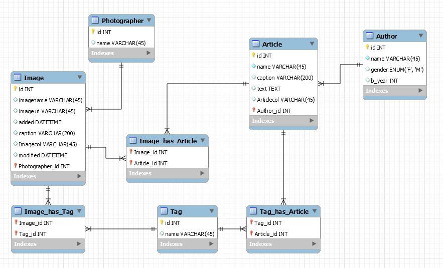

# DDL exercises
## Part 1: From database to model
- 1 (G) - Look at the model in the image below  
   
- 2 (G) - Write the sql to create the tables in the database as shown in the model
- 3 (G) - Write sql to add the columns to create the relationships between tables
- 4 (Y) - Alter the Image table to have default values for the 2 date types in the image table
- 5 (Y) - Enforce referential integrity between the tables by writing the foreign key constraints on the proper columns.
- 6 (G) - Save the script (.sql file)
- 7 (R) - Create a model in mysql workbench from the database (reverse engineer).

## Part2: From model to database
- 8 (Y) - Try creating the model in mysql workbench diagram editor
- 9 (Y) - Forward engineer the model to create the database
- 10 (Y) - Which way do you find most easy?
- 11 (Y) - Enter dummy data into the database.

## Part3: Create views
- 12 (R) - Create a view with authors and their articles
- 13 (R) - Create another view with tags, their article texts and image url