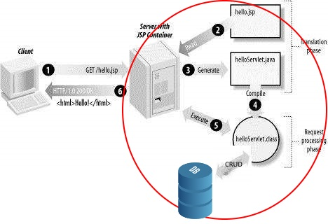
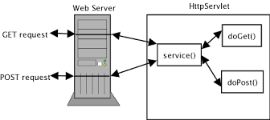

# Webprogrammering backend.

### Backend betyder det der foregår på Linux serveren 

HTML sider bliver genereret på Tomcat webserveren dynamisk. Dette bliver gjort ved at data fra databasen bliver hentet op og bliver indlejret i HTML baseret på det HTTP request der er kommet fra brugeren.

HTML bliver herefter sendt via internettet til brugerens browser. Browseren indlæser html siden og renderer et visuelt billede til brugeren (Det vi kalder en webside/web page).

  

### Ugeplan:  

| Dag     | Emne                                     |
| ------- | ---------------------------------------- |
| Mandag  | Klasseundervisning                       |
| Tirsdag | Vejledning med tutorer: Lav øvelse 1     |
| Onsdag  | Arbejd videre med Øvelse 1 og Review     |
| Torsdag | Vejledning med tutorer: Lav Cup cake web shop |
| Fredag  | Arbejd videre med Cup cake. Review med Thomas og Ronnie - Demo af jeres arbejde. |

### Oversigt over resourcer:  

| Emne                                     | Ressourcer |
| ------ | ------ |                             
| 1. JDBC og data mappers                  | [Eksempel her](https://github.com/HartmannDemoCode/Sem2/tree/master/DataMapper/src/main/java/data) |
| 2. HTTP: post and get requests, response, session cookie | [HTTP tutorial in 7 pages](http://www.tutorialspoint.com/http/): Læs fra overview til status codes |
| 3. Java Servlets: doPost, doGet, forward vs. sendRedirect, session object. Page Controller vs. Front Controller | [Http request](https://www.tutorialspoint.com/servlets/servlets-client-request.htm), [Http response](https://www.tutorialspoint.com/servlets/servlets-server-response.htm) [POST and GET](https://www.tutorialspoint.com/servlets/servlets-form-data.htm), [session](https://www.tutorialspoint.com/servlets/servlets-session-tracking.htm), [Front Control med servlet](https://github.com/HartmannDemoCode/Sem2/blob/master/ServletDemo/src/java/control/PageControl.java) |
| 4. MVC pattern                           | Model, View, Control: [Kort beskrivelse her](https://www.codecademy.com/articles/mvc) |
| 5. SQL exceptions                        | [Overview](https://www.tutorialspoint.com/jdbc/jdbc-exceptions.htm) |
| 6. 3-lags arkitektur                     | Domæne lag: Entitets klasser og foretningslogik |
| 7.  Git og github                        | gitignore, add, commit, push, pull, clone |
| 8. Java collections -> HTML views        | See [Eksempel her](https://github.com/HartmannDemoCode/Sem2/blob/master/ServletDemo/src/java/control/Collection2Html.java) |
| 9.  SQL injection                        | [Se eksempel her](https://www.journaldev.com/2489/jdbc-statement-vs-preparedstatement-sql-injection-example) |
| 10. Cross site scripting                 | [Forklaring her](https://stackoverflow.com/questions/2658922/xss-prevention-in-jsp-servlet-web-application), [Demo project here](https://github.com/HartmannDemoCode/Sem2/tree/master/crossSideScripting) |
| 11. Example project (Test3) | [Test3.zip](Test3.zip) |

### Plan for mandag:

1. Præsentation af CupCake-opgaven
2. Demo: Webprojekt, med simuleret database, uden frontend.
3. I laver jeres eget web-projekt ([Glarmester](Glazier-web.pdf)), uden frontend.

### Resultatet

Efter denne uge har i været igennem følgende:

1. I har lavet webapplikationer, der kan tage imod input og føre det ned i databasen. Ligeledes hente data fra databasen, så det kan vises i frontend.
2. I har stiftet bekentskab med MVC pattern
3. I har lært forskellen på page controller og front controller

#### Læringsmål

Efter denne uge er det meningen at du kan:

- Lave en java web application med MySql database
- Bruge MVC mønsteret til at lave webapplikation
- Kende til HTTP request og response samt bruge sessions

#### Erhvervskompetencer

Når ugen er omme har du opnået følgende kompetencer:

- Kende til MVC og kunne implementere dette design mønster i en webapplikation
- Kunne bruge sessions til at opretholde 'state' i en webapplikation
- Kunne bruge JDBC og data mappers til at persistere data i en webapplikation.

# Øvelser:

[Øvelse 1: ](Ex1.md) 

[CupCake - Ny version](https://docs.google.com/document/d/1XKK1GkVE-GtCPGEoVJ2SN4qHpfJnU9j7arugQv2-JfY/edit?usp=sharing) Første del af cupcake webshop øvelse. 
(Undskyld formateringen - jeg retter ASAP.)

## Onsdag - Review   
Onsdag taler vi om de øvelser i har lavet. Vi vil gerne høre jer fortælle om hvordan i har implementeret MVC pattern i recipe appen.

| Niveau | Demo                                     |
| ------ | ---------------------------------------- |
| Grøn   | Øvelse 1:  Afsnit 1 - pkt. 1-4 Afsnit 2 - pkt. 1-4 Afsnit 3 - 1 + 2 |
| Gul    | Øvelse 1: Afsnit 2 - pkt. 5  Afsnit 3 - pkt. 3  Afsnit 4 - pkt. 1-3 |
| Rød    | Øvelse 1 Afsnit 1 - pkt. 6 Afsnit 2 pkt. - 6 Afsnit 4 - pkt. 4 Afsnit 5 - pkt. 1 Afsnit 6 - pkt 1-4 |

## Fredag - Review   

Når vi mødes fredag vil vi gerne have en demo af jeres arbejde med cupcake opgaven.

Forventninger til arbejdet: gul bygger videre på grøn og rød bygger videre på gul:  

| Niveau | Demo                                     |
| ------ | ---------------------------------------- |
| Grøn   | Cupcake øvelse: Del 1-4. Alle gruppe medlemmer har commited til et fælles github repository |
| Gul    | Cupcake øvelse: Del 5                    |
| Rød    | Cupcake øvelse Del 6-7                   |

