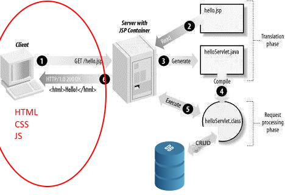

# Webprogrammering frontend.

### Frontend betyder det der sendes til browseren

HTML sider bliver genereret på Tomcat ved hjælp af JSP filer.   
JSP er en template engine der erstatter brugen af servletter til at danne HTML til brugeren. Med JSP får vi en java fil (Under overfladen en servlet) som vi kan skrive i som om vi skrev HTML med noget indlejret java. På Tomcat webserveren omdannes JSP til HTML, som  bliver sendt via internettet til brugerens browser.  
Browseren indlæser html siden og renderer et visuelt billede til brugeren (Det vi kalder en webside/web page).

**Vi skal arbejde med følgende emner:**

1. JSP sider og HTML - Dynamiske og statiske sider
2. HTML komponenter (Form etc.)
3. Styling med CSS (Framework som bootstrap)

### Oversigt over ugen:  

| Dag     | Emne                                  |
| ------- | ------------------------------------- |
| Mandag  | Klasseundervisning                    |
| Tirsdag | Vejledning med tutorer:               |
| Onsdag  | Arbejd videre med Øvelse samt review. |
| Torsdag | Vejledning med tutorer:               |
| Fredag  | Arbejd videre med Øvelse samt review  |

### Oversigt over mandagen:  

| Emne    |Kort version| Lang version   |
| ----------------- | ------------ | -------- |
| 1. HTML |[HTML template](sub/htmltemplate.md)| [HTML Quick guide](https://www.nobledesktop.com/html-quick-guide)  |  
| 2. JSP |[JSP basic](sub/jsp.md)| [Dynamiske sider med JSP](https://www.tutorialspoint.com/jsp/index.htm) |
| 3. Styling og DOM manipulation med CSS |[CSS template](sub/css.md)| [CSS tutorial (første 13 menu punkter)](https://www.w3schools.com/css/css_intro.asp), |
| 4. Layout med CSS  |[Layout template](sub/layout.md)| [Box Model](https://www.w3schools.com/css/css_boxmodel.asp), [Tables](https://www.w3schools.com/css/css_table.asp), [Forms](https://www.w3schools.com/css/css_form.asp), [Flexbox](https://www.w3schools.com/css/css3_flexbox.asp), [Navigation bar](https://www.w3schools.com/css/css_navbar.asp) |
| 5. At bruge et library: Bootstrap |[Bootstrap example](sub/bootstrap.md)| [Bootstrap tutorial](https://www.w3schools.com/bootstrap/), [Bootstrap templates](https://startbootstrap.com/template-categories/all/), [bootsnipp for små codestykker til design](https://bootsnipp.com/) |
| 6. At bruge en CSS pre-processor |[SASS example](sub/sass.md)| [SASS](https://www.tutorialspoint.com/sass/) |

### Gennemgang i klassen

1. Recap på ugen der er gået: Cup cake backend: 
    - Tegn E/R diagram
    - Tegn Arkitektur med Data og præsentationslag
    - Vis eksempel kode
      - Opret db fra model (address has person)
      - Lav DataMapper: [gist here](https://gist.github.com/Thomas-Hartmann/e477109c76ce9ec7e2aeb0b3c4a1bf75)
      - Lav Frontcontroller 
      - Lav view med JSP
      - Vis opsætning med ekstern css
      - Og alternativet - opsætning med bootstrap
2. Opsætning af projekt med statisk html, css/bootstrap
3. Styling af font-family, div (border, width, height, padding, margin), links: horizontal, form, button, images, table, lists etc.
4. Dynamisk genereret HTML vha. JSP
5. **M-V-C**: Data Access - JSP - Servlet. Frontcontroller med hidden parameters og switch i servletten.
6. Bootstrap: grid, form og table

### Øvelser i klassen

1. Lav jsp med table med personer (navn, alder) trukket fra servlet.

2. Tilføj css: font type, color, centrer tabellen ...

3. Style table med bootstrap (zebra stribet)

   ​

### Resultatet

Efter denne uge har i været igennem følgende:

1. I har lavet statiske html sider
2. I har genereret dynamiske html sider med jsp
3. I har arbejdet med styling af web sider både med rent CSS og med et framework som bootstrap. 

#### Læringsmål

Efter denne uge er det meningen at du kan:
- Redegøre for hvad DOM er og bruge css til at Manipulere med DOMen. 
- Bruge CSS til at Style HTML sider og lave et ordentligt layout til brugeren.
- Bruge et bibliotek som bliver hentet ned fra en CDN server og bruge Bootstrap til at style og lave layout med.

#### Erhvervskompetencer

Når ugen er omme har du opnået følgende kompetencer:

- Kunne CSS og Bootstrap til frontend programmering.
- Kunne anvende externe biblioteker i frontend programmering.

## Review  
Onsdag: [Frontend opgaver](onsdagsopgave.md) 

Fredag: [Omskriv og udvid Cup cake shoppen](https://docs.google.com/document/d/1DH8Apv6kSGZJc_hFKnIRcaw96WFEwf7YJZNpnPjV_E8/edit?usp=sharing)

 