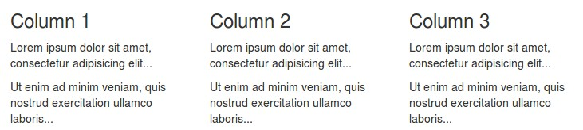

# Bootstrap library
Bootstrap is the most popular HTML, CSS, and JavaScript framework for creating responsive websites with fast setup.  
[Link to bootstrap ressource](https://www.w3schools.com/bootstrap/default.asp)
#### CDN
A CDN is a ressource on the internet that we can link to externaly (from outside our application). This should sit in the html page's `<head>`-section.
```html
<link rel="stylesheet" href="https://maxcdn.bootstrapcdn.com/bootstrap/3.3.7/css/bootstrap.min.css">
<script src="https://ajax.googleapis.com/ajax/libs/jquery/3.3.1/jquery.min.js"></script>
<script src="https://maxcdn.bootstrapcdn.com/bootstrap/3.3.7/js/bootstrap.min.js"></script>
```

#### Grid system
Bootstrap makes layout easy. A grid system with 12 columns that can be joined together to form 1, 2, 3 or more columns. This is an example with 3 column each spanning 4 grid-columns. In a `bootstrap row` the total must always be 12. (Notice the divs with attribute: `class="col-sm-4"`)
```html
<div class="container">
  <div class="row">
    <div class="col-sm-4">
      <h3>Column 1</h3>
      <p>Lorem ipsum dolor sit amet, consectetur adipisicing elit...</p>
    </div>
    <div class="col-sm-4">
      <h3>Column 2</h3>
      <p>Lorem ipsum dolor sit amet, consectetur adipisicing elit...</p>
    </div>
    <div class="col-sm-4">
      <h3>Column 3</h3>        
      <p>Lorem ipsum dolor sit amet, consectetur adipisicing elit...</p>
    </div>
  </div>
</div>
```
  

#### Styling tables
`<table class="table table-striped">`


