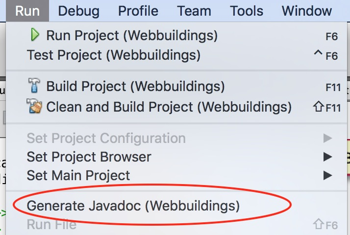
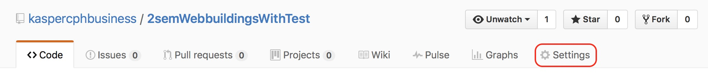
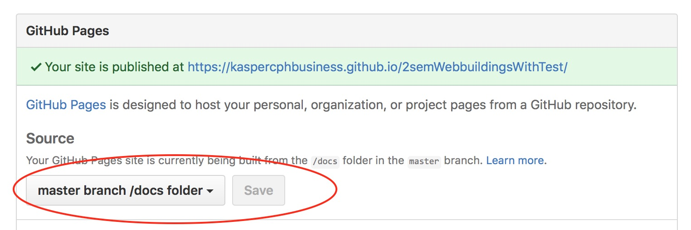
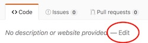

# How to use javadoc from Netbeans
Javadoc has been a part of the standard java toolbox since 1995, and has been used for all libraries since.


## The simple version using Netbeans
Netbeans support javadoc without having to do any further installation.

- Select the project for which you want to run javadoc
- Select "Generate Javadoc" from the "Run" menu



The files are placed in the folder "target/site/apidocs".

Notice, most of you will have the dist folder listed in your .gitignore file. This is the right thing - one should not have generated files under version control. 


## (RED) How to put the javadoc online on github
If you are interested in seeing your javadocs as part of the documents on github, here is what can be done. 

Along with the normal files making up a project, it is possible to also have a number of static web-pages on github. There are called [_github pages_](https://pages.github.com).

This is useful in itself, and can be used to make your github project look very good and professional. But here we will use this as a way to expose the documents used by javadoc.

### Making github show your javadoc files
Github pages has three ways of showing html pages. One of them is to tell github to use the projects docs folder.

#### Javadocs on github pages - by hand

1. create a folder named "docs" at the root of your github project
2. manually copy the javadoc files from dist/javadoc to this doc folder
3. add, commit and push the docs folder to github.
4. On the github page for your project, locate the settings (it is in the upper right side).<br> 
5. On the settings page you scroll down to the section on Github Pages and set the source to "master branch /docs folder"<br>

6. The url to your Github pages is now listed in the green area. Copy the URL, and go back to the front page of your project. You can put in the link to the pages file at the top. <br>


#### Change where Javadoc stores the generated files
Rather than copying the files from dist/javadoc to the docs folder you can change where javadoc puts its files in the first place.

You need to change the maven pom.xml file of your project. There is a section named `<build>`, and within that there is a section named `<plugins>`(notice the plural-s). You need to insert this javadoc plugin to change javadoc to put the javadoc in the docs folder.


```xml
<plugin>
	<artifactId>maven-javadoc-plugin</artifactId>
	<version>2.9</version>
	<configuration>
		<destDir>/docs/apidocs</destDir>
		<reportOutputDirectory>${basedir}</reportOutputDirectory>
	</configuration>
</plugin>
```

Now when you run javadoc, it stores the javadoc into the docs/apicocs folder instead of the .gitignored `target/site/apidocs` folder.
