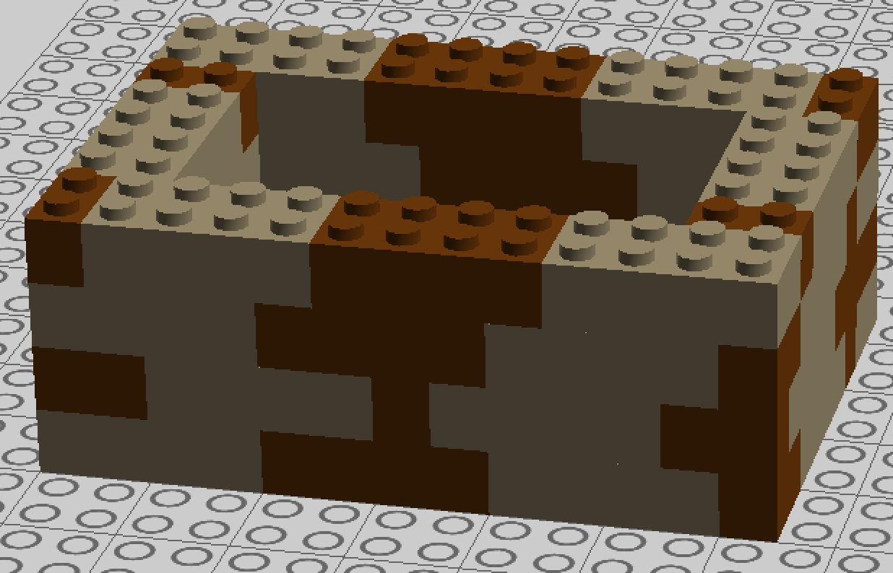

# Et lego hus
I har i de sidste uger arbejdet i grupper. For at give jer chancen for at checke at I også kan bygge et lille web-program selv, så skal I lave dette system alene.

Senere i semesteret skal I lave et system for Fog tømmerhandel som kan bruges til at håndtere salg af carporte. Et af de elementer der er i disse systemer er *styklister* - tabeller over hvilke dele (brædder, skruer, fundament blokke, mv) der skal bruges for at bygge en carport. 

Styklisten afhænger af hvor stor carporten skal være, samt nogle regler for hvordan en carport bygges.

I dette lille enmands projekt skal vi ikke beregne styklister for carporte, men for væggene i et lego hus 🙂.

### Aflevering
Der afleveres link til dit github projekt på moodle.

### Kravsspecifikation

Der skal laves et system hvor man kan registrere sig som kunde. 

Til det [kan benyttes den skabelon vi har lavet](https://github.com/DAT2Sem2017E/Modul3LogInSample).

#### Kundekrav

1. Som kunde vil jeg gerne kunne oprette en ordre på et lego hus sådan at jeg kan få en stykliste for huset. Ordren skal indeholde længde og bredde af lego husets vægge (angives i antal "prikker" huset skal være på hver led), samt hvormange klodser man ønsker der skal være højt.

2. Som kunde vil jeg gerne kunne se mine tidligere ordrer sådan at jeg kan se hvad jeg tidligere har bestildt.

3. Som kunde vil jeg gerne kunne se om min ordre er afsendt sådan at jeg kan planlægge hvornår jeg skal lege med lego.
4. Som kunde vil jeg gerne kunne se styklister for mine tidligere ordrer.

##### Styklister
Vi vil antage at vi bygger lego husene af tre typer klodser: a) brikker med 2x4 prikker, b) brikker med 2x2 prikker, og c) brikker med 1x2 prikker.

Et hus der er 13x9 prikker og 4 klodser højt kan se sådan ud:

og kan laves med følgende stykliste: 

| type | side 1 | side 2 | side 3 | side 4 | ialt x højde |
| ---- | ------ | ------ | ------ | ------ | ------------ |
| 2x4  | 3      | 1      | 3      | 1      | 32           |
| 2x2  |        |        |        |        |              |
| 1x2  | 1      | 1      | 1      | 1      | 16           |

#### Firma krav
1. Det skal være muligt for en ansat at se hvilke orderer der er i systemet. 
2. Det skal være muligt for en ansat at markere en ordre som afsendt. 

## Kvalitets krav til afleveret system
Det færdige system skal ligge som netbeans projekt på github.

Det færdige system skal være struktureret 3 lags modellen -  præsentationslag, forretningslag og data lag.

Det forventes at der er en facade mellem præsentations og forretningslag og evt. mellem forretningslaget og datamappers.

Det forventes at der *IKKE* kaldes forretningslogik (eller datamappers) fra JSP siderne.

Det forventes at session og requests attributter anvendes korrekt.

Vi vil anse det for en fejl hvis der bruges redirect hvor der burde bruges forward.

Det forventes at styklisterne ikke gemmes i databasen, men beregnes i forretningslaget.

Du skal håndtere exceptions.

### Grønne, Gule og Røde krav
#### Grøn
- Det forventes at du opfylder kundekrav 1 & 2- altså at man kan oprette en ordre og få en stykliste for denne. 
- Kravene til systemets kvalitet som nævnt ovenfor skal opfyldes.
- Du skal fange exceptions i servletten.

#### Gul
- Det forventes at du har kundekrav 4 med. 
- Det forventes også at du "bygger ordentligt", altså sørger for at du bygger i "forbandt" - altså klodserne i lagene er forskudt i forhold til hinanden. Her kan du [blive inspireret til flotte forbandt mønstre](https://www.randerstegl.dk/dk/mursten/fuldmuret-byggeri/forbandter-fuger).
- Kravene til systemets kvalitet som nævnt ovenfor skal opfyldes.
- Du skal lave en specialiseret exception som du kaster fra storage laget og fanger i servlet.

#### Rød
- Det forventes at du også har kundkrav 3.
- Det forventes også at du på den ene langside gør plads til et vindue (vælg selv en fast størrelse), og på den anden langside gør plads til en dør (vælg selv en fast størrelse.)
- Kravene til systemets kvalitet som nævnt ovenfor skal opfyldes.
- Det forventes at du bruger en front-controller som vist i det vedlagte oplæg.
