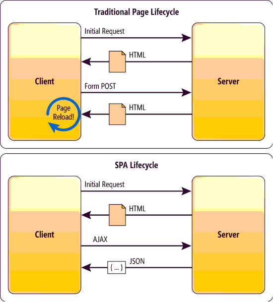

# Single Page Application (SPA)
  
- The first request to the webserver creates a response containing the index.html, the stylesheet(s) and the bundle.js javascript file.
- All subsequent requests are just answered with a little data in JSON format.
- Alternative frameworks
  - Angular2 (or AngularJS)
  - Vue
  - Ember.js
  - jQuery

## React
A javascript frontend **view** library designed to make **efficient**, **declarative** and **module** based javascript. React is based on modules called "components".  
Here is an example of a view with components inside components:  

  

### JSX examples
1. `<div><MyComponent/></div>`  
2. `<div><MyComponent someProp="Jesper Nielsen"/></div>`  
3. `<div><MyComponent someProp={someObj.field}/></div>`  
4. `<MyComponent><MySubComponent name={someVal}/></MyComponent>`

#### 2 kinds of Components
1. functional component
```js
function MyComponent(props) {
  return <h1>Hello, {props.someProp}</h1>;
}
```
2. class component:
```js
class MyComponent extends React.Component {
  render() {
    return <h1>Hello, {this.props.someProp}</h1>;
  }
}
```
[JSX ressource here](https://reactjs.org/docs/introducing-jsx.html)

### React
[Primary react reference](https://reactjs.org/docs/hello-world.html).  


## create-react-app
[create_react_app quick intro](create_react_app.md)  
[And the official site](https://github.com/facebook/create-react-app)

### Class demo
- Create new app with create-react-app
- Create a data store with persons and export it.
- Create a component that can show person details
- Create a component that can show list of persons

### Home work
- [Create a photo gallery](https://docs.google.com/document/d/1OGHsWR8gvubw4R64GBEQqkiPxZutxmWFsd7Ac5z0ygg/edit?usp=sharing)
