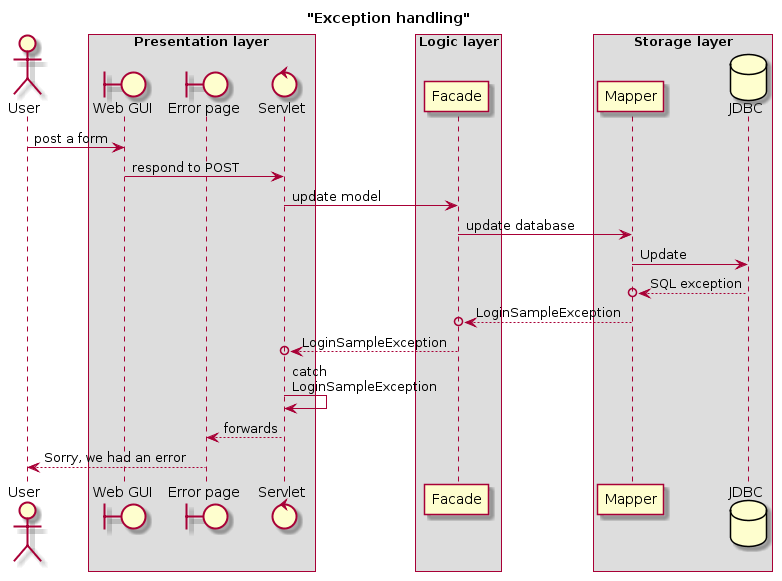

# Arkitektur

### Læringsmål
Efter denne uge kan du:

* Redegøre for begreberne lav kobling og høj binding i et konkret projekt.
* Forklare hvilke bindinger der er mellem lagene i en tre-lags arkitektur
* Kunne redegøre for hvilke desing mønstre du har brugt i dit system
	* F.eks. Facade, Singleton, Command, Front Controller
* Håndtere exceptions i en tre-lags arkitektur.

### Erhvervsrelevans
Der er dybest set ikke nogen systemer der ikke bygger på tre-lags arkitekturen. Der er flere design mønstre end nogen kan kende dem alle, men dem vi har valgt er både meget brugt og nyttige for de fleste systemer. Mange af de systemer I kommer til at bruge på jeres arbejde vil være bygget på brugen af design mønstre, så for at i kan forstå store systemer skal I kunne forstå design mønstre.


# Ugeplan
Dette minimodul (denne uge og det meste af uge 42) kommer til at have fokus på at lave endnu et web-system. Denne gang er tanken at I kommer til at gøre det individuelt. Der skal afleveres en opgave på github og digital ocean senest fredag den 20 oktober kl. 23:55.

Dag | Emne
---|---
Mandag | Klasseundervisning
Tirsdag | Vejledning med tutorer
Onsdag | Kun de grønne har vejledning her. Der afsættes tid til vejledning 2 og 2.
Torsdag | Vejledning med tutorer
Fredag | Evaluering & vejledning.
Fredag 20. oktober | Afleveringsfrist kl. 23:55

# [Individuel opgave](LegoHus.md)


# Vi er ikke de første...
Det vi lærer her på 2. semester er vi ikke har rodet med. Og hvis man ikke vil læse en hel masse, så er der en begynder der på stackoverflow i 2010 stillede dette spørgsmål:

>I am designing a simple web based application. I am new to this web based domain.I needed your advice regarding the design patterns like how responsibility should be distributed among Servlets, criteria to make new Servlet, etc.

Jeg kan klart anbefale at man [læser det første svar](https://stackoverflow.com/questions/3541077/design-patterns-web-based-applications).

# Design mønstre
Design mønste er best practice løsninger på ofte forkommende problemer. Et velbeskrevet designmønster har oftest en beskrivelse af hvad det er for et problem det forsøger at løse, hvordan løsningen typisk ser ud, hvilke variationer der er i løsningen, hvilke ulemper brugen af mønsteret har (ofte mere kompleks kode), og andre måder man typisk løser beslægtede problemer.

#### Resourcer
Der er en god [Lynda.com ressource om design mønstre](https://www.lynda.com/Developer-Programming-Foundations-tutorials/Foundations-Programming-Design-Patterns/135365-2.html).

Wikipedia er ganske udemærket omkring design mønstre:

* [Singleton](https://en.wikipedia.org/wiki/Singleton_pattern)
* [Facade](https://en.wikipedia.org/wiki/Facade_pattern)
* [Command](https://en.wikipedia.org/wiki/Command_pattern)
* [Front Controller](https://en.wikipedia.org/wiki/Front_controller)
* [Three layer architecture](https://en.wikipedia.org/wiki/Multitier_architecture)

Kasper har lavet en "eksemplarisk" [løsning på det klassiske login](https://github.com/DAT2Sem2017E/Modul3LogInSample).


### Singleton
Nogle gange kan det være nyttigt at sikre sig at der kun laves en instans af en klasse. Et eksempel kan være at sikre at der kun oprettes en database forbindelse.

Det gøres ved hjælp at følgende lille trick som bygger på static metoder og static felter:

```java
public class Connector {

    private static final String url = "jdbc:mysql://46.101.253.149:3306/useradmin";
    private static final String username = "doorkeeper";
    private static final String password = "bank3*andyouarein";

    private static Connection singleton;

    public static Connection connection() throws ClassNotFoundException, SQLException  {
        if ( singleton == null ) {
            Class.forName( "com.mysql.jdbc.Driver" );
            singleton = DriverManager.getConnection( url, username, password );
        }
        return singleton;
    }
}
```

Når man udefra vil have fat i en database connection, så kalder man metoden: `Connector.connection()`. Første gang man kalder metoden er `singleton` feltet `null` og man kommer ind i if sætningen og der oprettes en ny forbindelse som så returneres. Næste gang man beder om den, så vil `singleton` allerede have en værdi, og der oprettes *ikke* en ny, men den allerede eksisterende forbindelse bliver brugt igen.

> Det med at genbruge database connections er vigtigt, og i store systemer har man connections-pools som man så genbruger af. Det ligger uden for vores pensum at kikke på det. Der skal oprettes særlige klasser og metoder der lukker disse forbindelser igen, og dette er koplet til session begrebet på snedig vis. Vi bruger bare singleton, og kan evt. lukke database forbindelsen når der logges ud, men man skal så lige tilføje en metode til at nulstille singleton så næste bruger ikke får en lukket database forbindelse udleveret.


# Få afhængigheder og høj sammenhængskraft
Inden for software udvikling vil man gerne at programmerne 
er "*velstrukturerede*". Det er der skrevet meget om, men et helt fundamentalt begreb er at ethvert modul skal have **et** klart formål, og at det skal være muligt at dette modul skal have så få ydre afhængigheder.

Det betyder f.eks. at en metode kun bør gøre *en* ting, at en klasse kun skal bruges til at løse *en* overordent opgave. Og at den kode der inde i en metode skal arbejde på den eneting og ikke andet.

I login eksemplet er det sådan at Login-kommandoen kun afhænger af det request der kommer ind og facaden mod forretningslaget. Alt koden inde i metoden handler kun om det at håndtere login, og kun den del af login der gælder hvis det går godt (se sene om Exeptions).

Hvis vi kikker på UserMapper, så har hver af de to metoder også en klar opgave, den ene skal logge brugeren ind (i CRUD sammenhæng er det en "read", hvor vi finder brugeren i databasen), mens det anden metode opretter en ny bruger.

### Forskellige former for afhængigheder og sammenhængskraft
Hvis vi kikker på tre klasser - HashMap, Facaden og UserMapper - de to sidste fra dette projekt, og HashMap fra begyndelsen af semesteret. Alle tre klasser har flere metoder (ok, mindst 2).

* HashMap. Alle metoderne arbejder sammen på at stille funktionalitet der har med HashMap at gøre, put, get, isEmpty osv. Der er ingen metoder der ikke har med hash map at gøre, og alle metoder arbejder på de samme private felter i HashMap.
* Facaden. Her har ingen metoder noget med hinanden at gøre, og man kan derfor tro at der ikke er nogen sammenhængskraft i denne klasse. Men alle metoderne tilsammen er hvad der gør det muligt at nedbringe det overordnede antal afhængigheder i systemet, og lægger en lag-adskildelse ind i systemet. 
* Mapperen - de enkelte metoder har ikke noget med hinanden at gøre, men har det til fælles at de alle arbejder på den samme tabel i databasen, og at de alle arbejder med det samme domæne objekt.

### generelt om sammenhængskraft og afhængigheder
Ofte snakker man om sammenhængskraft og afhængigheder for **moduler**. I vores java verden er der tre niveauer af moduler, pakker, klasser og metoder. Begrebet sammenhængskraft og afhængigheder gælder for alle tre niveauer:

* **metoder** inden for en klasse skal have **et** klart formål og de enkelte dele af koden skal arbejde sammmen om at løse en vel defineret opgave. Den typiske fejl kan være at en metode "bliver for stor". Det betyder at den første del af metoden typisk arbejder på en anden opgave end den sidste. Det kan ofte løses ved at dele metoden op i flere mindre metoder (brug Netbeans refactor>Introduce>Method).
* **klasser** inden for en pakke skal have et klart formål. Det kan være at de alle er domæne objekter, det kan være at klassen er facade for hele pakken. Og de enkelte metoder inden for klassen skal have sammenhæng. Typiske fejl er at klassen ikke hører til i denne pakke (f.eks. at du har placeret en servlet i forretningslaget), eller at du måske har en hjælpe metode i en klasse der også bruges af andre klasser. Sådanne metoder skal ofte over i en fælles (fælles inden for pakken) klasse.
* **pakker** inden for dit system skal også have et klart formål. Det kan f.eks. være at pakken indeholder hele presentationslaget, eller alle domæne klasser. 

# Exceptions
I 1997 var der nogle folk på Sun Microsystems (senere købt af Oracle) der lavede et interface der hedder jdbc. Der er mange ting der kan gå galt i forbindelse med database kald, f.eks: rettigheder der ikke er i orden, fejl i forhold til SQL syntaksen og constraints der bliver brudt.

De folk der designede det interface for 20 år siden vidste at sådanne fejl ville komme til at ske. Men de havde ingen mulighed for at vide hvordan du, 20 år senere, ønskede at dit program skal reagere når der er fejl.

Exceptions er en mekanisme der kan bruges til på systematisk måde at dele arbejdet mellem biblioteksprogrammører og applikations programmører.

* *Biblioteksprogrammøren* (f.eks. dem der lavede jdbc) ved **hvornår** der sker en fejl (fejlene kommer via de lavniveau rutiner der bruges til at snakke med databasen på port 3306). Biblioteksprogrammørern ved ikke **hvordan** man skal håndtere fejlen (helt banalt fordi dit program ikke var skrevet for 20 år siden).
* Applikationsprogrammøren (dig) ved **hvordan** du vil håndtere fejl fra databasen (som regel ved at sende brugeren en besked om at vi desværre må starte forfra). Men du kan ikke styre **hvornår** fejl vil ske (netværksfejl f.eks.).

Dette diagram viser hvordan du kan håndtere en fejl der kommer fra databasen



Brugeren poster en form med data der skal opdateres nede i databasen. Men et eller andet går galt i JDBC laget (hvilket den kode der blev skrevet for 20 år siden opdaget), og der returneres ikke normalt, men kastes in SQLException.

Storage laget skal skjule at der bruges en SQL database for resten af dit system, og derfor skal der ikke slippe SQL exceptions ud af storage layer.
Mapperen fanger derfor SQLException. Men storage laget kan ikke kommunikere med brugeren (og kan derfor ikke gøre noget ved problemet). Det kaster derfor en LoginSampleExeption (som er defineret i Logic layer).

Logik laget kan heller ikke gøre noget ved problemet, og sender det derfor exception videre	tilbage til servletten.

Servletten fanger exception, og sender brugeren til en fejl-side. Der er forskellige muligheder for at håndtere det anderledes:

* Man sender brugeren hen til den side han kom fra hvis det er muligt at "prøve igen".
* Man analyserer fejlen og kan måske prøve igen uden at brugeren behøves at gøre noget. 

Bemærk, hvis man ikke håndterer fejlen, så vil tomcat håndtere det med en fejl 500, og det ser ikke godt ud!

### Oprette ny bruger
Når man gerne vil oprette sig som bruger på systemet, så skal man benytte en email der ikke allerede er brugt, og man skal skrive sit password 2 gange for at øge chanchen for at man kan huske det.

Hvordan skal vi checke de to dele?

* *De to passwords skal være ens*. Ideelt skal det checkes på browseren, vha javascript. I det udleverede program gøres det istedet på server siden, mere præcist, så smider Register command en exception hvis de to passwords ikke er ens, og denne exception fanges så i front-controller og man sendes tilbage til login siden med en fejlmeddelelse.
* *email må ikke eksistere i forvejen*. Man kunne fristes til at lave en metode i mapperen der kunne checke om denne email eksiterede i forvejen. En bedre løsning er at blot forsøge at oprette brugeren. Hvis man i database skemaet harerklæret at email skal være unik vil der blive kastet en SQLException hvis emailen findes i forvejen. Dels vil brugeren så ikke blive oprettet, og dels vil fejlen ryge op gennem systemet og blive fanget i frontcontroller og brugeren vil blive bedt om at prøve igen.


