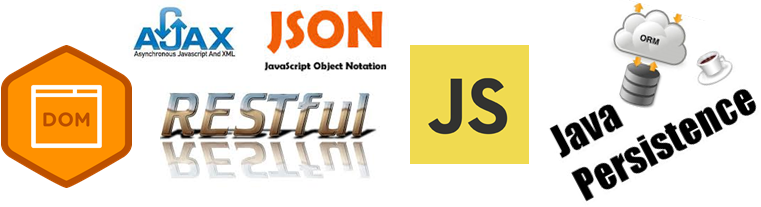
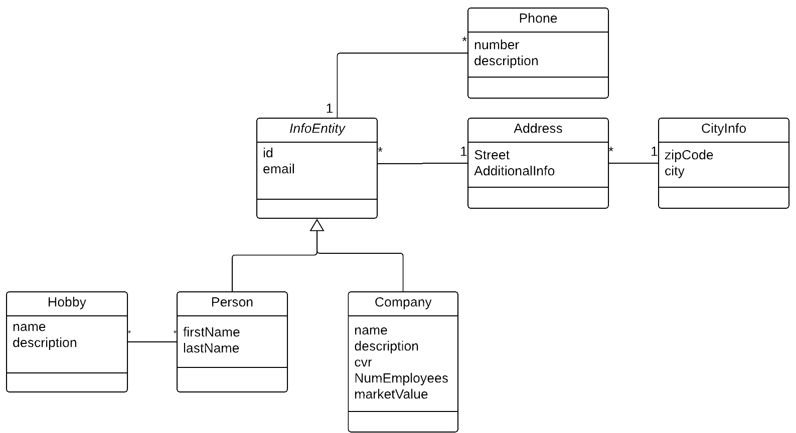
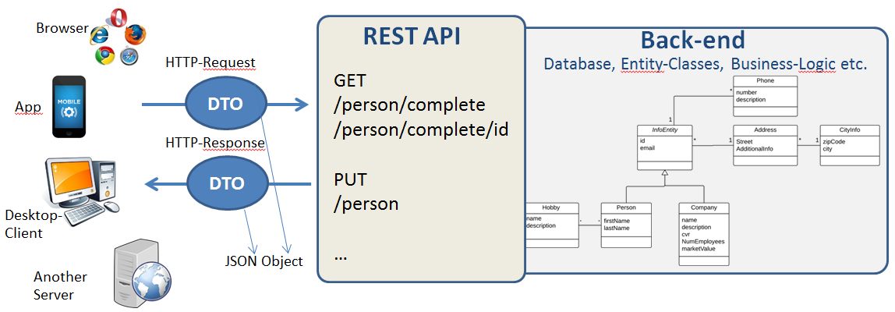

# Course Assignment 2

**Object Relational Mapping, REST, Test, Ajax and
JavaScript**



**Content of this document**

### Object Relational Mapping, REST, Test, Ajax and JavaScript

This CA builds a proof of concept solution, for what could have been a
(agreed very simplified) real life system. For this reason we assume
there will be a notable difference in how far the different teams will
come.

***This CA will strengthen your skills and knowledge related to:*** Use an Object Relational Mapper (JPA) to map between Java Objects and Relational Tables Use an Object Relational Mapper (JPA) to map Java Inheritance to Relational Tables Expose business functionality via a REST-API and JSON. Handle erroneous scenarios via a REST-API and JSON Build dynamic web-pages that builds content via JavaScript,DOM and AJAX up against a backend REST API.

#### Hand-in 
The code must be made available via Github. Your web-server must be available via a personal domain name and *only* accessible via https. You are expected to be able to explain/defend the design choices you have made. For example: your choice of inheritance strategy and use of uni/bi-directional relationships should be clear to you.

What is expected for the presentation Monday

You can each earn up to 20 study points for CA 2, depending on how far you have come (your ambitions/color taken into account), and your
presentation monday (March 19th.)

***This is what we expect from you.***

1.  An introduction + demonstration from the group, explaining how far you came, problems you might have had, and important, who did what.

2.  After that we expect each member to introduce a part of the CA using the “right terms” and if needed, focusing on parts where you would like our feedback.

### How and When to hand-in

Send a mail to[*iwantstudypoints@gmail.com*](mailto:iwantstudypoints@gmail.com), with
the class + *full name* of *all members in the team* + the link to your
server and the link to your github repository. No later than **Sunday
(18.03.2018) before 16.00.**

### How to get even more studypoints :-)

We would really like to receive your *feedback* related to flow-2.

If you include a section marked: FEEDBACK in this mail, with comments;
either from each member in, or alternatively from the team, you will
each earn additional *4 BONUS study points*.

### How to spend your four days

A proposed schedule to develop the system over 2 consecutive two-day
mini sprints is sketched below: Day-1+2: *Before the end of day two* should have a working restful api. Day 3+4: Complete the Front-end, missing back-end parts and deploy the system

## How to complete this CA in only four days

This CA is time intensive and if you are pressed for time, *it is more
important that you complete a little bit of* *all tasks*, instead of
completing all the steps of only a few tasks.

This CA is meant to be impossible (for an average student) to complete
in only four days. So you must take advantage of the fact that you are
three or four persons in a team and distribute (sprint) tasks between
team members.

## Before you start: 

*Read the entire assignment* (obviously), and spend time figuring out
how to divide the work between you, and if necessary design
interfaces/apis to help you work individually.

The section "Background, REST-APIs, DTO's and JSON" at the end of this
document elaborates a little on what skills you will use for this CA,
and on the use of DTO’s. It is recommended reading, but does not contain
new information.

## Project Description

**The Business Domain**

A new company plans to join the market for *information about people and
companies* (like Krak, De Gule Sider etc.). They plan to offer services
like:

- Get information about a person (address, hobbies etc) given a phone number
- Get information about a company given a phone number or cvr.
- Get all persons with a given hobby
- Get all persons living in a given city (i.e. 2800 Lyngby)
- Get the count of people with a given hobby
- Get a list of all zip codes in denmark
- Get a list of companies with more than xx employes
- Etc.
- In order to set up data, the API must also provide methods to add, delete and edit the Entities

Initially the following simplified version of the business domain has been approved as the background for a quick prototype application.



Yellow groups may leave out the inheritance part of the diagram; instead of the InfoEntity, Company, and Person classes, implement a single
Person class.

Green groups may additionally leave out the Hobby class, and hence avoid the many-to-many relationship between Person and Hobby.

You should, however, be aware of that all the relationships used in the diagram above, will be covered by exams. Make sure you understand this diagram and the differences between the relationships used between
classes.

## What to do in this CA, with a suggested time schedule

### Part-1 (day 1) Design your Entity Classes, tables and Façade(s)

**a)** Design Your Entity classes and tables (you decide whether to design
tables, and create Entity classes from the tables, or the other way
around, *but we suggest the last strategy*)

**b)** Implement one (or more) façade classes to simplify the operations on the
entity classes

The façade must have methods matching the initial requirements given on
the previous page, that is:

```java
Person getPerson(int id); 
List<Person> getPersons();
List<Person> getPersons(int zipCode);
Company getCompany(cvr);
```
(First line should provide a Person with all details. When you build your JSON for a specific REST CALL you decide for how much to include, according to you API description).

Observe: You don't need to complete your façade in day-1. Complete as much as you can on day 1 (including testing) and continue with the API on day 2. You can add the missing parts later *if you have time*.

**c)** Implement **JUnit** tests to verify the behaviour of your façade. Make sure to have a specific test database for this part (Use a separate persistence unit for a local test-database).

**d)** Test Data We want the final demonstration of this system to be as realistic as
possible, so we need (lots of) Test Data

**Hints:**

Use the script: [***populate.sql***](https://github.com/Cphdat3sem2017f/StartcodeExercises/blob/master/CA1/populate.sql) to set up values for all Danish zip-codes.

Use the study point exercise [](../exam_prep/exprep_rest_json.md) as an inspiration of; how to create large amounts of test data (don't create JSON, but an SQL-script)

### Part-2 (day 2) Design the REST API

#### Design the REST API

*Design the actual REST API for the application* (using the guidelines from the slides) which will make it possible to operate on the Database via the façade.

The API should include all four CRUD operations + most of the business services described in the section "The Business Domain". The API description must include a specification of the required JSON-data, and it’s response to errors (see next section)


  |GET   | Description|            
  |---- |---- |
  |api/person/complete |      Return all Persons, with all details, as a JSON object (As in *JSON example-1)*|
  |api/person/complete/id |  Return the Person (with the given id) with all details as a JSON object (as in *JSON example-1)*|
  |api/person/contactinfo |  Return all Persons, with only contact info, as a JSON object (As in *JSON example-2)*|
  |api/person/contactinfo/id  |  Return the Person (with the given id) with only contact info, as a JSON object (As in *JSON example-2)*|
|  **POST**  | |          
| api/person      |  Create a new Person given a JSON object (as in *JSON example-1)* |


Complete the API description for all services.   
(As a check for whether your API description is accurate enough, consider yourself in a situation where you were the API *user* having to write the client code, given only the API description. Or consider that you were going to outsource this part, and do the front-end part in parallel with this.)

#### Error Handling
- Complete the API description with a supplementary description of the response for erroneous scenarios.
- The response must include a proper HTTP status code and a JSON response with a description of the error and (*only*, when in debug mode. Hint: use web.xml to declare this attribute) the Exception Stack Trace (if any).

#### Implement the REST API 

Implement the REST API using JAX-RX and GSON (or a similar framework if
you prefer. *Do not* handwrite the json serialization)

### Part-3 (day 3) Design WEB pages that uses the API

Implement a number of web pages that uses the API, using HTML, (CSS and
Bootstrap), JavaScript, DOM and AJAX (via fetch).

Feel free to do this in any way you like, but a single page application
that allows for reading, Creating Editing and Deleting a Person would be nice.
Also consider page/pages like:
- Get all persons with a given hobby
- Get all persons living in a given city (i.e. 2800 Lyngby)
- Get the count of people with a given hobby
- Get a list of all zip codes in denmark
- Get a list of companies with more than xx employes

### Part-4 (day 4) 
Complete the missing parts and upload to Digital Ocean.

#### Background, REST-APIs, DTO's and JSON  
*This CA involves the following skills:*
- Design/implement a RESTful API
- Use JSON as a mean to transfer data between disparate systems
- Object Relation Mapping (JPA) to simplify DataBase access
- JavaScript and Ajax to build dynamic pages on the client (browser)
- Deploy code to a cloud provider

The following pages will provide some background and hints which should
help you in fulfilling this CA

#### Data Transfer Objects (DTO’s)

An important thing to understand is that the diagram, given on on a
previous page, represents the internal business logic on the server.
What we chose to expose to the “outside world” via our REST-API, can,
and will be quite different.

One reason for this can be network performance. For example we could
decide to combine a number of calls into one (returning a result
representing the individual calls) since we know that the TCP/IP-stack
adds an overhead to each call. For small amounts of data this overhead
could easily exceed the size of the actual data. As an example, let's
see how we send/receive information about a Person. Internally a person
is represented by 6 different entities (InfoEntity, Person, Address
etc.). When transferring data between our services and clients however,
this could easily be combined into a single object as sketched below
(newlines added for readability):

```json
{
  "firstName": "xxx",
  "lastName" : "xxx",
  "email" : "xxx",
  "phones": [{"number":"xx","description":"xx"},{"number":"xx","description":"xx"},..]
  "street": "xxxx",
  "additionalInfo" : "xxxx",
  "zipcode": "nnnn",
  "city" : "xxxx"
}
```

*JSON example-1(hobbies left out)*

We could also go the other way around, and decide to return less data in
a call because the client might not need all information available. As
an example, let’s take a look at the diagram and imagine we needed
contact information only for a client. Here we could return a JSON
object as sketched below:

```json
{
 "id":1,
 "name": "Lars Mortensen",
 "email":"lam@lam.dk",
 "phones": [{"number":"xx","description":"xx"},{"number":"xx","description":"xx"},..]
}
```
*JSON example-2*

Objects, like the ones above, are often referred to as a Data Transfer
Objects [(DTO)](http://en.wikipedia.org/wiki/Data_transfer_object)

Another reason for defining DTO’s could be that we don’t want to
reveal the internal design so, as an example, we could rename all
variables so e firstName could be fn and lastName ln etc.

The figure below is an attempt to visualize DTO’s and the difference
between the actual business logic and what is exposed in JSON-objects
via REST.



### From Java to JSON and from JSON to Java

Since we will implement the REST API using Java, it is vital that we can
convert our Java objects into JSON and the other way around. When there
is a one-to-one mapping between Java and JSON we have seen that this is
simple, using for example the Gson library.

If we have a JSON String like:

```json
{"id":1,"name": "Lars
Mortensen","email":[*lam@lam.dk*](mailto:lam@lam.dk), "phone" :
"12345678"}
```

We can transform it into a matching Java object (assuming we have a Java
Person class with the three attributes, and the JSON above as a string)
as easy as:

```java
Person p = New Gson().fromJson(jsonString, Person.class); 
```

And we can transform a Person object into a string like: `String jsonString = new Gson().toJson(p);`

If you take a look at the document
[*https://sites.google.com/site/gson/gson-user-guide*](https://sites.google.com/site/gson/gson-user-guide)
you will see that we can easily handle arrays and many more complex
situations.

### From Java to JSON and from JSON to Java with DTO’s

The problem with the strategy above is that is requires us to have a
matching Java Class to do the conversion. Take for example *JSON
example-1* on the previous page. This object doesn't match any of our
existing Entity Classes, so we must create a matching Java class,
PersonMapper, with the only purpose of serving as a template for our
JSON-conversions. These classes, however, are very simple to create,
since they are *data-only classes* (no behaviour), so it's a common
strategy to use. Add mapper classes like this, in a specific package
(jsonmappers or dto) to clearly distinguish them from the Entity
classes.

This is the recommended (simplest) way of handling JSON conversions
