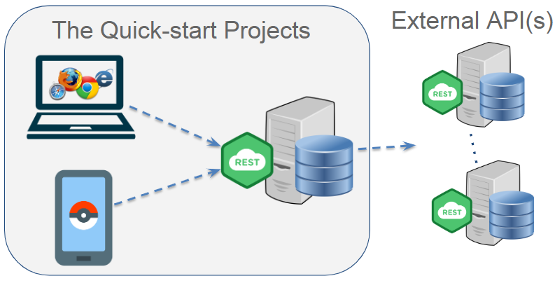
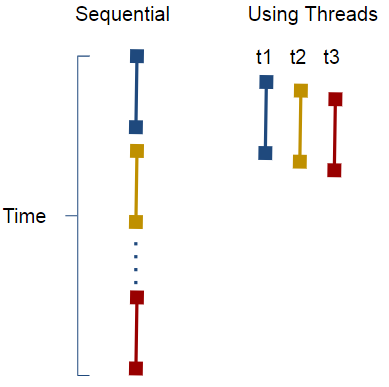

# CA 3 Create a quick start project
Containing backend with Token based authentication, protected rest endpoints and paralel (Thread based) server to server communication.

### A “Quick Start Project” for JAX-RS, React and React Native based applications



The idea with this CA is to create a *Quick-start Project*, which will
allow developers to quickly get started with new applications with an architecture as sketched above. That is; applications where the server
needs to communicate with other servers (think Momondo or similar sites) and includes both a web-client and a mobile client.

This will prepare you for the [*semester
project*](https://docs.google.com/document/d/1RAopyembfCjfyzVu_jRDRKaXU3-IK5I0AggAI1_bwTQ/edit?usp=sharing)
which requires an architecture similar to the one sketched above.

*Please read the last page of this document, to see why this CA is also
relevant also for the exam*

### 

### This CA will strengthen your skills and knowledge related to:
 Continued use of JPA, JAX-RS and Jave
 Introduce a way to handle Authentication/Authorization and Passwords for SPA’s
 React and React Router
 React Native
 Build and deploy full stack SPA-applications supplemented with mobile clients

#### The requirements for the Quick Start Project is as follows

 - It must include, three separate projects (backend, web-client and a mobile-client), but all must be “runnable” immediately when cloned, after the database is set up, and URLs are adjusted.
 - URLs used by the client-projects must be read from a file settings.js
 **The backend project** must provide an initial setup with entity classes for *users* and *roles*
 - The backend must provide a JWT-based authentication/authorization mechanism.
 - Passwords must be protected using a hash/salt-strategy 
 - The backend must provide (at least) the following REST-endpoints:
   - An endpoint that requires the user-role
   - An endpoint that requires the admin-role
   - An endpoint that fetches data from a minimum of five remote servers (use [*https://swapi.co/*](https://swapi.co/)
 for demo) (see hints and requirements at the end of this document)
   - An endpoint that can handle server-side pagination, and deliver, initially, large amounts of “dummy data” 
 - **The Web-client project** must be implemented with React and provide: 
   - A login/logout option
   - It must show the username for a logged-in user
   - A React Router Based setup with initial pages/routes that shows  data fetched from the four endpoints mentioned above (the last one should use a pagination control) and a welcome page with  initial instructions on how to use the Quick Start Project.
   - Must be styled (use bootstrap unless you have knowledge from somewhere else) to be immediately “presentable” (don’t overdo this part, focus on functionality)
 - **The App project** must be implemented with React Native and implement (as a minimum)
   - A welcome page
   - A page that fetches data from the backend (for green and yellow
 students, feel free to use an unprotected endpoint.
 - The Backend project on GIT must include a `README.MD` file with instructions in how to use (all parts of) the Quick-Start Project

### Hand-in and Deployment

 - All code must be available on Github.
 - The hand-in must include a hosted demo-version of the Quick Start Project as outlined below

    - Your web-server must be available via a personal domain name and *only* accessible via https.
    - You decide on how you deploy the Project (see this [*document*](https://docs.google.com/document/d/18mHv36MGK-tFoVXM7-4dXKlURrpbbiOQm4xvWW8iXew/edit?usp=sharing) for options)
   - The React Native client must be downloadable via a link to Expo.

#### How and When to hand-in

**This must include all relevant links to the hosted version of the
Project, that is:**
 - Link to the backend
 - Link to the Web-client
 - Link to fetch the App from Expo

### What is expected for the presentation Monday or Tuesday

Schedule for Reviews/presentations Monday+ Tuesday will be added here
before the end of the week.

Review-times + your links to agenda: A-class B-class

***This is what we expect from you.***

1.  An introduction + demonstration from the group, explaining how far you came, problems you might have had, and important, who did what.

2.  After that we expect each member to introduce a part of the CA using the “right terms” and if needed, focusing on parts where you would like our feedback.

### Hints (and for also a few requirements)

##### Calling an external API from your backend (GET)

The requirements states you have to make a request up against five
external servers. Just use Swapi for all five requests, but your task
will be to “assemble” the responses into one final response which you
return from to your clients.

You can use this small utility function to make a request from your
server up against the Swapi-api:

```java
public String getSwappiData(int id) throws MalformedURLException, IOException{
    URL url = new URL("https://swapi.co/api/people/"+id);
    HttpURLConnection con = (HttpURLConnection) url.openConnection();
    con.setRequestMethod("GET");
    con.setRequestProperty("Accept", "application/json;charset=UTF-8");
    con.setRequestProperty("User-Agent", "server");
    Scanner scan = new Scanner(con.getInputStream());
    String jsonStr = null;
    if (scan.hasNext()) {
      jsonStr = scan.nextLine();
    }
    scan.close();
    return jsonStr;
  }
```

### External requests and performance  



The method given above blocks several places, waiting for “the other
end”. The effect of this is, that if you just call it five times from
one of your end-points it could take almost five times longer than
necessary (could be a serious problem if the servers are “slow”) as
sketched in the first part of this figure.

This solution is acceptable if your group is green

All other groups should go back and take a look at the exercise from
week-1, day-3 related to Futures and Callables. Use this exercise as
inspiration to how to do it in parallel, as sketched in the second part
of the figure.

#### Appendix:

*This is added just to show, that you need the code for this CA, for the
exam. It’s how we get the security part into the exam, and also *one of
the ways* for us to give exercises which involve both a backend and a
frontend that can be implemented in less than two hours.*

### Using your Quick-start Project  


#### General part Explain how JAX-RS endpoints can be secured using annotations
 Explain (and demonstrate if you like) the flow in a Token-Based Authentication setup
 Explain strategies for how to handle passwords, and how you have done it in your CA-3 project
 Explain about CORS, and how you have used it in your CA-3 project (if not used, explain why it wasn’t necessary)

#### What if I get “stuck”

#### Practical part start

*Here you could be requested to use your Quick-start project (CA-3) to
set up a simple **secured** JAX-RS backend (with a supplementing
database), and a matching React Frontend (or if you prefer React
Native)*

