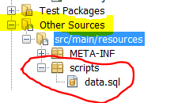

# Exercise - JPA Entity Mappings

These exercises will investigate a great deal of the most useful
Object-Entity mappings available in JPA. You should however, be aware
that the amount possible annotations are enormous. For this exercise we
will create the tables from the Entity classes, so we know exactly what we do. At the end however, you should create a new project and its
entity classes from the tables generated by this exercise. This will
show you a great deal of those annotations we haven’t used (because we
are using default values)

### Getting Started
---------------

1. Create a new plain (Maven) java application, and add the packages:
**entity**, **test** and **enums**
In the **test** package, add a class Tester including a main method.
Create a test method in this class from which we will do all
interactions with the Entity Manager.
2. Create a local MySQL database
3. Create an **Entity** class, Book with only one field (apart from the id) *title*. Use `GenerationType.IDENTITY` to let the database generate ids automatically (using AUTO_INCREMENT). Make sure you understand why you are requested to use `GenerationType.IDENTITY` and not one of the others.
4. Include the MySQL JDBC Driver to the project. (if it wasn’t included in step 3)  
Right Click dependencies → Add Dependency → Type "mysql-connector-java"
in the Query Text Field → Select version **5.1.39** (will save your for a lot of time-zone related problems) of the Driver.
Open the pom-file to see how the dependency was added to the file.
5. in your test method, create an EntityManager (use the slides if you
need hints)

For all of these exercises, you should (initially) select the Drop and
Create strategy in your persistence.xml file: `Drop and Create`

6. In the test package, add a new class SchemaBuilder and provide the
class with a main(..) method.

Add this line to the method: Persistence.generateSchema("NAME\_OF
YOUR\_PU", null);

*You can recreate your database whenever you like, by running this
method. But just using your Entity-classes, will ALSO create the
database if Create or Drop and Create was choses.*

Auto generation of Ids and MySQLs AUTO\_INCREMENT
-------------------------------------------------

7. Add a few books to the project and verify that we can find them using
the entity manager.
Verify that a matching table has been created, and populated with data.

Now, add a new folder **scripts** to "src/main/resources" as sketched to
the right, and add a file **data.sql** to the
folder.

Use plain SQL to insert a number of Books in the file as sketched
below:

```sql
INSERT INTO BOOK (TITLE) VALUES ('book-3');
SET @book1 = LAST_INSERT_ID();
INSERT INTO BOOK (TITLE) VALUES ('book-4');
SET @book2 = LAST_INSERT_ID();
```

Add the following line to your persistence.xml file:

```
<property name="javax.persistence.sql-load-script-source"
value="scripts/data.sql">
```

Re-run the project and observe/explain the id's found in the Book table.

8. Add a new entity class Customer, initially only with a *firstName* and
*lastName* property and using the GenerationType.Identity strategy.

Add the necessary SQL to the data.sql script to add a few customers.

Re-run the project and verify that you can find the new customers.

Enums
-------

9. Add the following enum to the project:
```java
public enum CustomerType {
  GOLD, 
  SILVER,
  IRON, 
  RUSTY 
}
```

-   Provide the Customer class with a CustomerType field, + a getter and setter.

-   In your test code add a CustomerType to your test Customers.

-   Run and explain the column and values in the Customer table.

-   Add this annotation `@Enumerated(EnumType.STRING)` on top of the CustomerType field

-   Run and explain the column and values in the Customer table.

Collections of basic types
--------------------------

10. Provide the customer with a list of hobbies as sketched below:

```java
private List<String> hobbies = new ArrayList();
```

And the methods: `addHobby(String s)` and `String getHobbies()` (return a
comma separated list with all hobbies)

Test and verify how the list is stored by the Customer table

Do you like what you see?

If not, add the following annotation to the hobbies List

`@ElementCollection()`

Regenerate (run the project) tables and observe the result. I assume you
agree, this looks at lot better ;-)

Yellow/**Red**: But what if you don’t like the names of the generated table and its column names.

Remember, by default, JPA uses *convenience over configuration* and
supplies default values for everything you don’t supply. But YOU NOT JPA
should be in control, to make a perfect database. Use info on this
[*link*](https://wiki.eclipse.org/EclipseLink/Examples/JPA/2.0/ElementCollections#Basic_Collections)
and add the necessary annotations so the name of the new class is
hobbies, the column with the foreign key is named Customer\_ID and the
column with the actual hobby is named HOBBY.

Maps of Basic Types
-------------------

11. Add a map to your Customer class as sketched below:

`private Map<String,String> phones = new HashMap();`

Add a method: `addPhone(String phoneNo, String description){..}`

Add a method: `getPhoneDescription(String phoneNo){..}`

Add a few phone numbers to your customer in the Tester class, and
execute (which should regenerate the tables).

Bloooob, do you like what you see?

If not, add the following annotations to the map:

`@ElementCollection(fetch = FetchType.LAZY)`
`@MapKeyColumn(name = "PHONE")`
`@Column(name="Description")`

Execute and observe the generated columns and values. Make sure you
understand the purpose of each of the annotations

