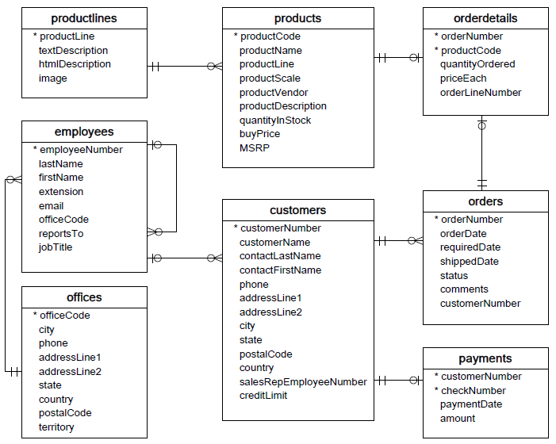

Querying JPA with JPQL
----------------------

This exercise uses a slightly modified version of the database,
introduced here, as its starting point:
[*http://www.mysqltutorial.org/mysql-sample-database.aspx*](http://www.mysqltutorial.org/mysql-sample-database.aspx)

You should start this exercise by downloading our edited version of the
database from
[*github*](https://github.com/Dat3SemStartCode/scripts_unrelated/blob/master/ORM-JPA/ExerciseJPQL_classicCarsEdited.zip)

#### The purpose of the exercise is twofold:

-   Show how to create a JPA based design from an *existing database*

-   Use this database and its data to get experience with JPQL (Java Persistence Query Language)

Before you start you should investigate the ER-diagram given in the
first link, to an overview of the tables involved in the design. Make
sure you understand the difference between an ER-diagram and a UML
classs diagram.

Getting started:
----------------

Create a new plain java project "classicmodels".

*Set up the Database*

1.  Create a folder *scripts* and unzip and copy the script classicCarsEdited.sql into the folder*.*

2.  If you have setup Netbeans to use MySQL, navigate to the services tab, select your local MySQL Server, right click and create a new Database "classicmodels". Go back to the script, right click and select "Run File". When prompted for the database to use, select the classicmodels database and execute the script.

3.  If you prefer to use MySQL Workbench, just replace the step two with what you usually do here when creating a new database from an existing script.

4.  Verify that the tables has been created and populated with data.

*Creating the Entity Classes*

-   Use the wizard "New Entity Classes From Database" to create Entity classes matching the tables in the classicCars database.

-   On the first wizard page, select the database and "Add all" to include all tables

-   On the second wizard page write ***entity*** for Package and deselect "Generate JAXB Annotations"

-   The original designers of the database went for the plural form of naming tables (employee**s** instead of employee). This is something we definitely not want reflected in our class names. Go to the Class Name column as sketched here, and rename all class names to their singular form. 
- `Order` is a reserved word (in JPQL) so rename this class to ClassicOrder


-   On the last wizard, unselect the "Use Column Names in Relationships" since this typically ends up with some very unintuitive names

Tasks:
------

Explain the generated classes, especially the two (extra) classes
generated, ending with PK.

Provide a single façade class, with the following methods:

### Creating/Editing Entities:

-   createEmploye(..) →Creates and return a new Employee (See hints)

-   updateCustomer(Customer cust) Updates and returns the updated Customer
An additional Customer findCustomer(int id) method could make it easier to test the updateCustomer(..) method.

### Querying

-   getEmployeCount() → return total employees

-   getAllEmployees() → Return a list with all employees

-   getCustomerInCity(String city) → Return all customers living in a given city (Barcelona has 1)

-   getEmployeMaxCustomers() → Return the employee with most customers (Answer: 1401, Pamela Castillo)

-   getOrdersOnHold() → Return all orders where status is "On Hold" (Answer: orderNumbers = 10334, 10401, 10407, 10414)

-   getOrdersOnHold(int customerNumber) → Return all orders on hold for a given customer (try Customer 144) (Answer: orderNumber=10334)

-   List&lt;String&gt; getCustomerNamesSorted() → Return a list with (only) customerNames sorted ascending
 Often (as in almost always) we don’t want a result that matches an Entity class, but a result that matches a specific customer requirement.
Create a new package, mappers and add this class to the package:
public class CustomerSimple {\ public String firstName;\ public String lastName;\ public String customerName;\ \ public CustomerSimple(String firstName, String lastName, String customerName) {\ this.firstName = firstName;\ this.lastName = lastName;\ this.customerName = customerName;\ }\ }
Add additional methods to the facade as sketched below:

-   List&lt;CustomerSimple&gt; getCustomersSimple() → Returns a List of CustomerSimple fetched from Customer

-   CustomerSimple getCustomerSimple(int id) → Returns a single CustomerSimple for the given id
 ***Hints** for the two exercises above: Read about Result Classes (Constructor Expressions)* [**here**](https://www.objectdb.com/java/jpa/query/jpql/select)

-   Add a new *public* field orderCount to the CustomerSimple class, and change the constructor accordingly. Change the two methods above to set this value (number of orders for this customer)

Hints (Real exam exercises will not provide this kind of hits):
---------------------------------------------------------------

Employee does not (automatically) get Auto ID’s. Generate the id automatically using the
Table-strategy
```java
@Id
//Add this below the the @Id annotation in the Employee Entity class
@GeneratedValue(strategy = GenerationType.TABLE,generator="s1")
@TableGenerator(name="s1",table = "My_SEQ", initialValue = 2000,allocationSize = 25) 
```

A new employee must have an office, assign the office with officeCode =
"1" (observe: Key is a string) to all new Employees

### ER-Diagram (Crows Foot) for the classicmodels DataBase




[*Crow’s Foot
Notation*](http://www.vertabelo.com/blog/technical-articles/crow-s-foot-notation)


