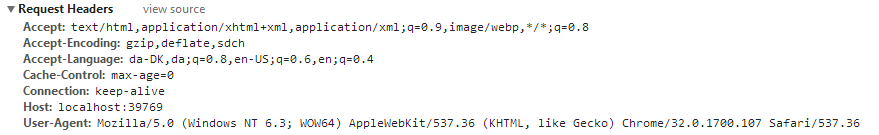
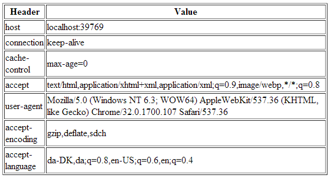
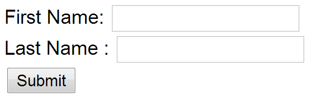

# Exercises - Network and HTTP

*You can do most of the exercises in this document by yourself, but they
are meant as exercises with a supplementary discussion in the class, so
you will gain a lot more from participating in the class.*

Understanding Basic Network Terms like: IP, TCP/IP, DNS, DHCP and more.

Most of these exercises are meant to be answered in text, so write down
your replies so you will remember.

1.  What is your *public* IP address right now, and how did you find it?

2.  What is your *private* IP address right now (do this both at home and in school), and who/what gave you that address?

3.  What’s special about these address ranges?
- 10.0.0.0 – 10.255.255.255
- 172.16.0.0 – 172.31.255.255
- 92.168.0.0 – 192.168.255.255

1.  What’s special about this ip-address: 127.0.0.1?

2. What kind of service would you expect to find on a server using these ports: 22, 23, 25, 53, 80, 443?

3.  What is the IP address of studypoints.dk and how did you find it?

4.  If you write [*https://studypoints.dk*](https://mystudypoints.dk) in your browser, how did “it” figure out that it should go to the IP address you discovered above?

5.  Explain shortly the purpose of an ip-address and a port-number and why we need both

6.  What is your (nearest) DNS server?

7.  What is (conceptually) the DNS system and the purpose with a DNS Server?

8.  What is your current Gateway, and how did you find it?

9.  What is the address of your current DHCP-Server, and how did you find it?

10. Explain (conceptually) about the TCP/IP-protocol stack

11. Explain about the HTTP Protocol (the following exercises will go much deeper into this protocol)

12. Explain (conceptually) how HTTP and TCP/IP are connected (what can HTTP do, and where does it fit into TCP/IP)

### HTTP

Before you start, you should create a document (or a just a piece of paper) where you should write down the Status Code generated by each of the following exercises (You need this for exercise 4-c)


**1)** Monitoring HTTP Headers 1

- Create a new NetBeans Maven Web-project.
- For this exercise we will just use the default index.html generated by
NetBeans.
- Press the run button. When the file is shown in the browser (Chrome),
open the *network tab* in the developer window Ctrl-shift-j) and press F5

- Observe and explain each of the values monitored (use view source to see
the plain messages).

Hints: In order to better observe the values related to Caching you
might need to:
- Go back to NetBeans and rename your file to index1.html
- Go back to your browser and (while the developer window is open) change
the url to point to the new file.

Observe the values

Press F5 and observe the values again.

Explain what you see.
**2)** Monitoring HTTP Headers 2
- Add an image to the page
- Add an external style sheet to the page: `(<link rel="stylesheet" type="text/css" href="myStyle.css">)`

Reload the page again, observe the request(s) being made, and explain the purpose of the Connection: header.

**3)** Monitoring HTTP Headers 3 (Response-codes 3xx)


In the Web-project, created for 1+2, add a new HTML-page called r.html
and add this text in an h1-tag “You got redirected to me”.

Use the Wizard to create a servlet called redirect

Remove the processRequest and the doPost method completely from the generated servlet-code.

In the `doGet(..)` method replace the call to `processRequest()` with this
line: `response.sendRedirect("r.html");`

While your server is running, open a (Chrome) browser, and in this, open Chrome Developer Tools and the network tab.

Enter the address for the servlet `(http:localhost:8080/redirect)` into
the browser and explain:
- The two http-request you see
- How the browser knew where to go in the second request

**3a)** Redirecting to https instead of http

In Google Chrome enter this address (with the developer window + the network-tab open), and **exactly** as it is spelled):

[*http://studypoints.dk:*](http://studypoints.dk)

Explain the first two request monitored (notice where you requested to go, and where you actually ended).

Important: Later this week, you will learn how to setup your own server to use https, and ONLY https.

**4a)** Status Codes (5xx)

Use the Wizard to create a servlet called ups
In the `processRequest(..)` method, just before the try-statement add this
code: `int result = 100/0;`

While your server is running, open open Chrome developer tools and the network tab and call the servlet.

Write down the response code generated by the server as for the previous exercises

**4b)** Status Codes (4xx)

While your server is running, open open Chrome developer tools and the
network tab, and call this address: http://localhost:8080/i\_dont\_exist

Write down the response code generated by the server as for the previous exercises

**4c)** Status Codes - Ranges

Your document, containing the Status Codes for all the exercises done so
far, should now contain codes like 2xx, 3xx, 4xx and 5xx.

Explain (write down your answer so you won’t forget) the meaning of the
first digit in the 3-digit Status Codes you have seen so far.

**6)** Get HTTP Request Headers on the Server

We have seen that a HTTP request from a Browser typically includes a lot
of headers with information related to the client.





This information is available to a servlet (is available to any
web-server technology) via the request object. Create a Servlet, which
should output this information in a table as sketched in this figure (or
in any way you like, but *don’t focus on presentation*).

*Hints: Use the request objects getHeaderXXX methods.*

**5)** Get/Post-parameters

Create a new html-file in the web-project made in exercise
1.

Add a form to the file, including two text input boxes and a submit button as sketched below:

Add an extra input field to the form with `type=”hidden”, name=”hidden”` and ` value=12345678`.

Add the value `#` for the forms action attribute.

Set the forms method-attribute to the value “GET” (actually the default
value) and test the form. Observe what happens in your browser's address
field.

Change the forms method-attribute to the value “POST” and test the form.
Observe the change in your browsers address field. Figure out (using
Chrome Developer Tools), how parameters are passed in, for a POST
request.

*Write down your observations*

### Session and Cookies
For the next two exercises/demos you should create a new web-project.
Both the demos uses a Servlet.

**7)** Sessions (Session Cookies) 

In your web project use the wizard to generate a new Servlet

a) Enter *SessionDemo* as the name of the Servlet and *servlets* as package name

b) Right click the file and select Run to see “what is does”

c)  Change the generated processRequest(..) method as sketched below.

```java
protected void processRequest(HttpServletRequest request, 
                              HttpServletResponse response)
          throws ServletException, IOException {
    String name = request.getParameter("name");
    if (name != null) {
      request.getSession().setAttribute("name", name);
    } else {
      name = (String) request.getSession().getAttribute("name");
    }
    response.setContentType("text/html;charset=UTF-8");
    try (PrintWriter out = response.getWriter()) {
      out.println("<!DOCTYPE html>");
      out.println("<html>");
      out.println("<head>");
      out.println("<title>Servlet SessionDemo</title>");
      out.println("</head>");
      out.println("<body>");
      if (name != null) {
        name = (String)request.getSession().getAttribute("name");
        out.println("<p> Welcome " + name  + " !</p>");
      } else {
        out.println("<h2>Please enter your name, and submit</h2>");
        out.println("<form action='SessionDemo'>");
        out.println("<input type='input' name='name'>");
        out.println("<input type='submit'></form>");
      }
      out.println("</body>");
      out.println("</html>");
    }
  }
  ```
**a)** Enter your name and press submit, copy the URL in the browser into your clipboard, close the tab (but not the browser) and load the page again in a new tab using the URL in the clipboard.

**b)** Now close your browser (you could even close your laptop, but don’t ;-) , open it again and load the page again using the URL in
the clipboard

**c)** While doing the things in step e, you should monitor the content of your local cookies and the HTTP requests being sent, using the development tools in Chrome.

**d)** **Most import part of this exercise:**
Explain (on paper) how Cookies can be used to maintain “state” on the client between subsequent calls to a server, even when a browser has been closed down.

***Write down your observations!***

