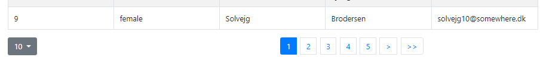

# Handling large amounts of data


*Navigate to this link
(*[**https://www.bilbasen.dk**](https://www.bilbasen.dk)*) using your
favourite browser and search for a car, Volvo for example. Observe how
this site only presents a small amount of the found cars, and then lets
you sort, filter and navigate forward and backwards in the full
record-set. This is one way (not the only) to handle large data-sets,
which is what this exercise will focus on.*

What you have to do in this exercise
------------------------------------

This exercise will lead you through the following steps:
#### Green level
1. Setup a mock-backend with huge amounts of data, supporting filtering, sorting and pagination.
2. Test the mock-backend API, to see what it offers
3. Demonstrate how an attempt to handle all data at once, eventually will fail
4. Use a Pagination Component to handle large (but not huge) amounts of data client-side
#### yellow
5. Use a Pagination Component to handle filtering, sorting and pagination, using a mock-backend that can provide a HUGE amount of data.
#### red
6. Create your own Java, Jax-RS and JPA backend, with an API that matches the mock-api

### Getting started (step-1) 

*We will do this part together in the class, where some additional
explanation will be given*

a. Create a new React project with create-react-app. Clean up the
generated code as usually.

b1. install json server globally

`npm install json-server -g`

b2. In the root of the new project, install the following dependency:

`npm install dk_test_names`

The first line above installs the mock-server globally, skip this if
already done. The second line install a small utility-program, that can
create “huge” amounts of test-data for the json-server

c. Now install the dependencies for
[*react-bootstrap-table2*](https://react-bootstrap-table.github.io/react-bootstrap-table2/),
which is the suggested library to use for this exercise (to limit the
size, code is distributed over several packages, the ones below are what
we need)
  npm install react-bootstrap-table-next  npm install bootstrap@4.0.0  npm install react-bootstrap-table2-filter  npm install react-bootstrap-table2-paginator

d. Open the project in your JavaScript editor: code .

e. Verify that you can run the project: npm start

f. Creating test data, and starting the json-server

-   In the root of the project, create a folder data

-   In this folder add a single JavaScript file called *makeData.js* and
  paste in the following content:
  const makeTestData = require("dk\_test\_names");  makeTestData(Number(process.argv\[2\]),{fileName:"data/db.json"});

-   Open package.json and paste the following lines into the
  script-section:
  "backend": "node data/makeData",  "postbackend": "json-server --watch data/db.json --port 1234"

 Test the mock-backend API (step-2)
-----------------------------------

Now you should be ready to start :-)

Open a **new** terminal in the **root** of the project and type this
line:
  `npm run backend -- 2`

Verify that the terminal reported (among other things) `Created 2 names in the file data/db.json`, and verify that this file actually exists.

Now, in the terminal window, hit CTRL-C, to terminate the server, and
run the script again, this time with the value 2000:

`npm run backend -- 2000`

Verify that the file was generated with 2000 names.

In this way you can start the server with “any” number of names to test
your applications ability to handle large amounts of data.

*For the last part of this exercise you can use the utility-function
used in makeData.js, to create a SQL-insert script for your own backend
,that will insert many thousands Persons into your own backend database
as described* [**here**](https://www.npmjs.com/package/dk_test_names)

#### Test the “features” offered by the mock-backend:

Restart the mockend-server, with 5000 names.

In a browser test **all**, the following commands:

*Get all data:*
  http://localhost:1234/api

*Sorting, first ascending then descending:*
  http://localhost:1234/api?\_sort=firstName&\_order=asc  http://localhost:1234/api?\_sort=firstName&\_order=desc

*Pagination* (Use developer, tools to verify that the server sends a
response header X-Total-Count. You need the total count for the
pagination control)
  http://localhost:1234/api?\_start=0&\_end=10  http://localhost:1234/api?\_start=10&\_end=20

*Pagination with filter (exact match)*

http://localhost:1234/api/?\_start=0&\_end=30&firstName\_like=xxxxx

*Pagination with filter (like match)*

http://localhost:1234/api/?\_start=0&\_end=30&firstName\_like=xx

This is the API we will use for the following ;-)

 Read all, build the DOM, and render - *all in one step*
--------------------------------------------------------

**a)** In App.js, remove all content inside the App-class, and copy the
content below in instead.

```javascript
state = {names: [], msg:""}
async componentDidMount(){
  console.time("fetching");
  this.setState({msg:"Loading..."});
  const names = await
  fetch("http://localhost:1234/api").then(res=>res.json());
  console.timeEnd("fetching");
  console.time("rendering");
  this.setState({names,msg:""});
}

componentDidUpdate(){
  console.timeEnd("rendering");
}

render(){
   return <div>
     {this.state.msg}
     <h3>Change me to build a table with all names returned </h3>
   </div>
 }
```

The code uses the async-await construct to provide “synchronous like
behaviour” for the fetch statement so we can measure the time it takes
to load the 2000 names. It also uses the componentDidUpdate lifetime
method to measure the time it takes to build the DOM and render
(triggered by setState in componentDidMount) the page.

**b.** Write down the time it took to load the data, and the time it
took to render the simple div.

You should have observed that loading was “relatively” fast (obviously
this depends on the network connection), and rendering even faster,
since it’s just a simple div, being rendered.

**c.** Now change the render method to render a table or a ul with all
the data fetched from the backend.

Measure write down the times one more time, and compare the values, and
user experience, with what you measured in b.

If you feel that everything “seems fine” try to increase the number of
names generated by the server to 5, 10 or 20 thousand, until you
definitely not like what you see.

**d.** With 10 or 20 thousand or perhaps even more, what was the time
used to fetch the data, and what was the time use to build the dom, and
render it?

**e.** Do you think your app could had handled this amount of data
loaded from the server, if it only rendered small parts at any given
time (using a pagination control) ?

 Read all data, build the DOM for only a small part, and render only this 
--------------------------------------------------------------------------

This will continue where we left in the previous step, but instead of
rendering all data fetched from the server, we will only render smaller
parts using a pagination control as sketched below:

**a.** Restart the server to provide an acceptable max amount of data,
like 1000 names
**b.** In the src folder create a new file *AppClientPagination.js* and
copy ALL content from App.js into this file.

**c.** We need a way to switch between the two “pages” in our SPA. Next
week we will introduce a router-component, built for this kind of work.
For this simple app however, just copy the following into your index.js
file (just above the ReactDom.render(..) method).

```javascript
class Selector extends React.Component {
 state = { app: <App /> }
 select = (evt) => {
   const app = evt.target.id;
   switch (app) {
     case "a2": this.setState({ app: <AppClient /> }); break;
     case "a3": this.setState({ app: <AppRemote /> }); break;
     default: this.setState({ app: <App /> })
   }
 }
 render() {
   return (
   <div>
     <div onClick={this.select} >
       <a href="#" id="a1"> Render All</a>
       <a href="#" id="a2"> Paginate on Client</a>
       <a href="#" id="a3"> Paginate on Server </a> 
     </div>
     {this.state.app}
   </div>
   )}
}
```

Change the ReactDom.render(..) method to use this simple Selector
component as sketched below:
  ReactDOM.render(&lt;Selector /&gt;, document.getElementById('root'));

Import your new Component just below the existing import of &lt;App/&gt;
like this:
  import AppClient from './AppClientPagination';

**d.** Verify that you can switch between the two pages. Since they are
identical right now, add a header in the beginning of each of the render
methods so you can see which one is rendered.

**e.** Now add sorting functionality, using the guidelines found
[*here*](https://react-bootstrap-table.github.io/react-bootstrap-table2/storybook/index.html?selectedKind=Sort%20Table&selectedStory=Enable%20Sort&full=0&addons=1&stories=1&panelRight=0&addonPanel=storybook%2Factions%2Factions-panel)
(Just change columns to reflect the columns you want in the table, and
change products to get the loaded names from state)

**f.** Add filtering functionality (on gender, and firstName) using info
found
[*here*](https://react-bootstrap-table.github.io/react-bootstrap-table2/storybook/index.html?selectedKind=Column%20Filter&selectedStory=Text%20Filter&full=0&addons=1&stories=1&panelRight=0&addonPanel=storybook%2Factions%2Factions-panel)

**g.** Add pagination functionality using the info found
[*here*](https://react-bootstrap-table.github.io/react-bootstrap-table2/storybook/index.html?selectedKind=Pagination&selectedStory=Basic%20Pagination%20Table&full=0&addons=1&stories=1&panelRight=0&addonPanel=storybook%2Factions%2Factions-panel)
(Increase the amount of data returned by your server, according to your
timing-observations in the previous step.

**h.** Reconsider your reply to e) in the previous part, given what you
have observed in this part

### (Yellow level) Handle pagination, sorting and filtering on the (mock) server


*This part is a bit more complicated, since you will have to do many of the things, done by the control in the previous step. So make sure to read to information related to*[ **Remote Tables**](https://react-bootstrap-table.github.io/react-bootstrap-table2/docs/basic-remote.html) *before you continue.*


**a)** Create a new JavaScript file *AppRemote.js* and copy EVERYTHING
from *AppClientPagination.js* into the file. Import the file in
index.js, and change the Selector class to let you select this new
“page”.

**b)** To simplify this part, remove everything related to filtering. We
will focus on sorting and pagination (server-side) only.

**c)** Since this requires a bit more than client-side pagination, here
is some snippets to get you started.

Set up the initial state in the class like this: state =
{names:\[\],sizePerPage: 10, page:1, totalSize: 0 }

You need to do a lot more server requests, compared to the previous
example where the server only was involved once. Add this method to the
the class, and make sure you understand *each line* in the provided
code:

```javascript
handleTableChange = async(type,props) => {
   const { page, sizePerPage,sortField,sortOrder} = props;
   console.log(props)  //Monitor this output, when you test this step
   const sortStr=(sortField && sortOrder) ? `&_sort=${sortField}&_order=${sortOrder}`:"";
   const currentIndex = (page - 1) * sizePerPage;
   const end = currentIndex + sizePerPage;
   const URI = `${URL}?_start=${currentIndex}&_end=${end}${sortStr}`;
   let p = await fetch(URI).then(res => {
     const totalSize = Number(res.headers.get("x-total-count"));
     if(totalSize){ this.setState({totalSize})  } 
     return res.json()
   });
   const names = await p;
   this.setState({ page,sizePerPage,names })
 }
 ```
Remove everything from `componentDidMount()` and add this instead (first
call to the server):
```js
const {page,sizePerPage} = this.state
this.handleTableChange("didMount",{page,sizePerPage});
```

Add these two lines to the start of the render method:
  ```js
  const {page,sizePerPage,totalSize} = this.state;
const onSizePerPageChange = this.handleSizePerPageChange;
  ```

And finally add these props to the `<BootstrapTable.../>`
  ```js
  onTableChange={this.handleTableChange}
pagination={paginationFactory({ page,sizePerPage,totalSize,onSizePerPageChange })}
```

d. Now increase the number of names handled by the backend, to a much
larger number (10.000) and verify that you can sort and paginate,
delegating most of the work to the backeend.

e. Use Chrome developer tools and the network tab to verify that each
interaction with the Bootstrap-table control (sorting and moving forward
or backwards) involves a server call and and a corresponding response

 ### (RED level) Create a Java, Jax-RS and JPA backend, with a matching API

Now, your final step will be to create YOUR OWN backend, using the technologies you learned in period-2.


**a)** Create a new MySQL database and a table that matches what we done
so far:
```sql
CREATE TABLE Names (
  id INT(6) PRIMARY KEY,
  gender VARCHAR(10) NOT NULL,
  firstName VARCHAR(40) NOT NULL,
  lastName VARCHAR(60) NOT NULL,
  email VARCHAR(60)
);
```

**b.** Next create a “bunch” of test names for the database. You can use
the small utility function imported in makeData.js by pasting this code
into the file (see here for
[*details*](https://www.npmjs.com/package/dk_test_names)).

```js
makeTestData(10000,{fileName:"dbsetup.sql",arrayManipulator:mapper})
function mapper(names) {
 return names.map(n => `(${n.id},'${n.gender}','${n.firstName}','${n.lastName}','${n.email}')`)
   .reduce((acc, cur, idx, src) => {
     let val = acc + "\n" + cur + (idx < src.length - 1 ? "," : ";")
     return val
   }, initValForReducer);
}
const initValForReducer = `INSERT INTO names (id,gender,firstName,lastName,email) VALUES`
```

Run this code from a terminal in the data-folder like this:

`node makeData.js`

This will create 10000 insert statements (in the file dbsetup.sql) for
the table created in a). Execute the statements and verify that you have
a database with 10000 names.

**c.** Create a new maven-web project with NetBeans

**d.** Create an Entity Class (using the wizard) from your DataBase

**e.** Create a Single GET Rest-endpoint that returns all (in this first
step) names.

Using the information found
[*here*](https://wiki.eclipse.org/EclipseLink/Examples/JPA/Pagination),
related to how to handle pagination with JPA, change the endpoint to
handle the following:

**f.** Handle pagination, using the same API, as provide by the
json-server.

**g.** Handle sorting, using the same API, as provided by the
json-server

**h.** Replace the URL in your frontend, to use this new real backend
and verify that it “works”

**Hints:** You need to set both the `X-Total-Count` header and the
required CORS headers. Use the template below for your Endpoint:

```java
@GET
@Produces(MediaType.APPLICATION_JSON)
public Response getJson(@QueryParam("_start") String _start, @QueryParam("_end") String _end,
                        @QueryParam("_sort") String _sort, @QueryParam("_order") String _order) {
   ...
   List<Name> names = query.getResultList();
   return Response.ok(names).header("X-Total-Count", count)
                               .header("Access-Control-Allow-Origin", "*")
                               .header("Access-Control-Expose-Headers", "X-Total-Count").build();
   
 }
 ````
