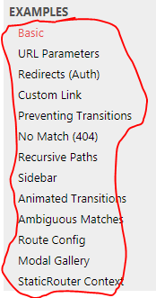
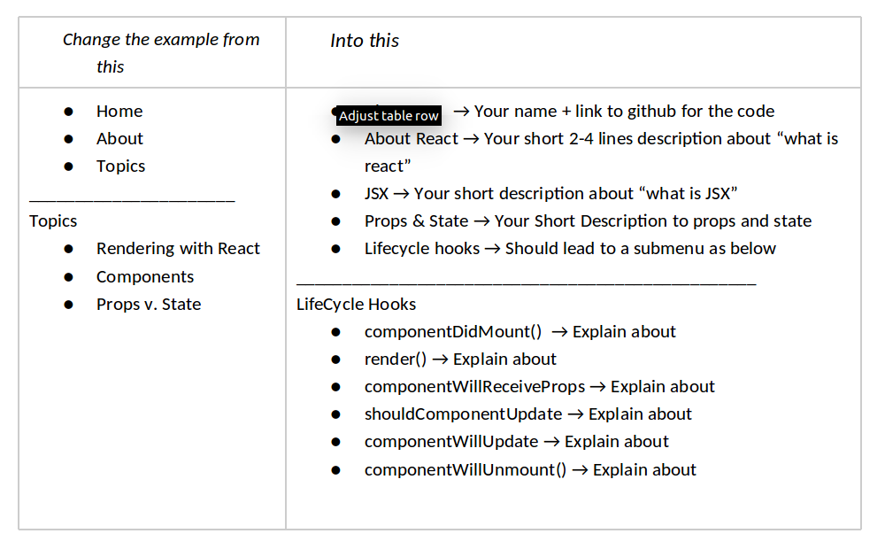
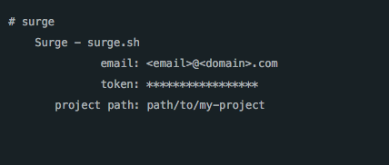

# A quick intro to React Router

### What is a client-side router?

Watch this [*video*](https://www.youtube.com/watch?v=l9eyot_IXLY),

The task for the following will mainly involve cut and paste, but you
need to come up with relevant content for the example, and deploy it
(will take you less than two minutes ;-)

**a)** Enter this link [*https://reacttraining.com/react-router/web/example/basic*](https://reacttraining.com/react-router/web/example/basic)
into your browser, and “play” around with the example (in the middle) to
see the react-router in action.

**b)** Test all the example links in the left-menu, and make sure to
“play around” with all examples, to see what you can do with
react-router.

**c)** Setup a new react-project to hold the code for this router
example as explained in the top of the black part (the part to the
right) here:*https://reacttraining.com/react-router/web/guides/quick-start*

**d)** Clean up the start code and paste in the code for the[*Basic*](https://reacttraining.com/react-router/web/example/basic)
example

e\) Test and verify that the example works, the same way as on the
tutorial page.

**f)** change the Basic example from left side to how it is on the right side

**g)** **Deploy the project** (for this small exercise we will deploy to
surge.sh, since it takes less than two min ;-)

**h) Build the project**

In a terminal, in the root of your project, type **npm run build**. This
will "build" your project into a folder ***build***.

**i) Deploy to surge**

Open a terminal and type **npm install -g surge**

This will install the command line interface to surge, a *free hosting
server* for static code

Still in the root of your project, type: **surge --project ./build
--domain A\_DOMAIN\_NAME.surge.sh**

If this was your first time running surge, you'll be prompted to create
an account. Add email and password, then hit enter. You’ll then see an
output similar this:

That’s it. Your REACT Client is now hosted like `<domain name>.surge.sh`

**j)** Verify that you can start the client, and use the backend, via
this client.
