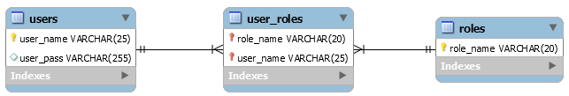
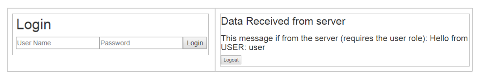
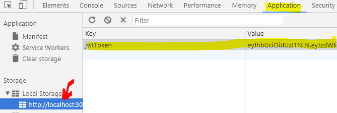

# A JWT-based Authentication Strategy 
### for a REST-API.

*In the following, you will implement a JWT-based Authentication
mechanism (obviously using an external package to handle the
cryptographic JWT operations). This is actually the beginning of*
[**CA-3**](https://docs.google.com/document/d/1GZvVK-dGHjyP30BULhtRz9EFYd9MOzdtChoV6X_mRnQ/edit?usp=sharing)*,where you will have to create a start-seed for a Java - React - React
Native based project.*

*The requirements for our solution will be:*

- *After an initial **traditional** successful login, the client will be
  supplied with a valid JWT*

- *REST endpoints should be able to use the normal security annotations (see [**jersey
  doc**](https://jersey.github.io/documentation/latest/security.html)*)

- *Access to endpoints will be determined by the validity/content of
  the supplied JWT*

- *User Passwords must be handled correctly (not stored in
  plain text)*

### Getting started

**Clone** (observe the branch) this startcode: `git clone -b fall_2018 --single-branch https://github.com/Cphdat3sem2018s/jwtBackend.git`

The start code, uses a *simple role-based user setup, where users are
stored with a user\_name,* and a *password.*

*Roles are kept in a separate table, with a many to many relationship
between the two tables.*



After cloning you should:

1.  Create a database for the project

2.  Create the missing persistence.xml file and let it point to
  this database. *Use the name “**pu**”* and it will “fit right
  into” the existing code.

3.  Create the database tables using the create strategy in
  the persistence-file.

4.  Create a few test **roles** and **users** by running the file:
  SetupTestUsers.js in utils
*This will throw an exception! Check the code to see why, and fix the“problem”*

### Inspect the code
The project includes basic Entity classes for users and roles and a few
predefined packages and classes which you should investigate before you
continue.

- *the rest package*: includes two dummy-endpoints (Observe the use of
  jerseys security annotations)

- *The exceptions package*: Exceptions used by the example + a mapper
  to provide errors as JSON

- *The entity package*: Entity classes to hold users and
  security roles. Observe the two methods: verifyPassword(...)
  and getRolesAsString() in the User entity-class. Also take a look
  at the simple UserFacade class in the package.

- *The security package*: This is where code that handles most of the
  security live. You can, *and should*, abstract away this package.
  It is meant to be used “as is”.

This exercise will *initially* only focus on the backend, so we will use
Postman as the client for all testing.

#### Testing the Security Functionality 

**a)** Test, and verify that you *cannot* access the two security
protected endpoints:  
- `/api/info/user`
- `/api/info/admin`

*Before you continue, check the code (in the rest package) to see what
it takes to protect an endpoint*

**b)** Test the **POST**-Login Endpoint: **xx/api/login** via Postman to
verify you are connected to the database. Add this JSON to the body, to
include username and password with the request:

`{"username":"user","password":"test"}` **or**
`{"username":"admin","password":"test"}`

Also test with a non-existing user and a wrong password.

Verify that, for a successful login, the system returns a token. This is
what you need to provide with all subsequent request to access protected
resources.

**c)** Login, via postman as in step b) but this time copy the returned
token into the clipboard.

**d)**

Test the two endpoints, as in step a) Make sure to include the token
with the request in a http-header “x-access-token”

Verify that it’s not enough to have a valid token, you must also have a
*valid role* to be authorized.

**Important:** In your future Single Page Applications/ mobile apps, you
will have to do something similar to what you did above.

- Login to the server
- Store the returned Token “somewhere”
- Attach the token to all future request which requires an authenticated user

**Final reflections.**

Answer the following questions:

- What is the advantage (if any) for a REST-based API of using JWT’s
  compared to session Cookies

- What is the disadvantage (if any) with the implemented JWT-solution

- What will a client (Single Page WEB, Mobile App, etc.) have to do in
  order to use this API

## Handling Passwords the right way

This part assumes you have completed everything up until now.

The provide design has a SERIOUS FLAW in that it store passwords in
plain text. You will have to fix that in this part of the exercise.

Before you start, make sure you understand topics like:

- why you cannot **ever, ever, never** store users passwords in plain
  text (even if you are making a site for your son’s football club)

- why old hash-algorithms like SHA1 is almost as bad as storing
  passwords in plain text

- rainbow tables

- bcrypt, and why *slow is good*

- why we need an algorithm we can make *even slower*, as time goes by.

There are several implementations of the bcrypt algorithm, and also algorithms just as good or even better. For this exercise/semester we suggest jBcrypt which offers an extremely [*simple API*](https://www.mindrot.org/projects/jBCrypt/).

**a)** Delete all rows in your database and include the required
dependency in your pom-file:

```xml
<dependency>
  <groupId>org.mindrot</groupId>
  <artifactId>jbcrypt</artifactId>
  <version>0.4</version>
</dependency>
```

**b)** Update the project to hash passwords before they are stored using
`BCrypt.hashpw(..)` , and use `BCrypt.checkpw(..)` method to check an
incoming password up against the hashed password in the database.

**Hint:** This should be *very simple*. The code is designed so that
changes only should be made in the User Entity class. In this class, do
the hashing in those methods where you can provide a new password, and
change the method verifyPassword(..) to use the `BCrypt.checkpw(..)`.

**c)** Run the file SetupTestUsers.java one more time. This method also
makes a simple test of the `verifyPassword(..)` method.

**d)** Repeat the accept test from step J, in the previous exercise to verify that login, works as before.

### Handling CORS

The provided startcode includes the two filters given below, which will
set CORS headers on ALL responses. This is probably not what you wan’t
so you could and should (in a real-life application) adjust to your
specific needs. Also, depending on how you deploy your application, you
might not need the CORS headers at all. You can remove CORS-handling by
commenting out the two `@Provider` statement

**CorsRequestFilter.java**
```java
import java.io.IOException;
import java.util.logging.Logger;
import javax.ws.rs.container.ContainerRequestContext;
import javax.ws.rs.container.ContainerRequestFilter;
import javax.ws.rs.container.PreMatching;
import javax.ws.rs.core.Response;
import javax.ws.rs.ext.Provider;
//Comment out the annotation below to disable CORS-handling
@Provider  //This will ensure that the filter is used "automatically"
@PreMatching
public class CorsRequestFilter implements ContainerRequestFilter {
  private final static Logger log = Logger.getLogger(CorsRequestFilter.class.getName());
  @Override
  public void filter(ContainerRequestContext requestCtx) throws IOException {
    // When HttpMethod comes as OPTIONS, just acknowledge that it accepts...
    if (requestCtx.getRequest().getMethod().equals("OPTIONS")) {
      log.info("HTTP Method (OPTIONS) - Detected!");
      // Just send a OK response back to the browser.
      // The response goes through the chain of applicable response filters.
      requestCtx.abortWith(Response.status(Response.Status.OK).build());
    }
  }
} 
```

**CorsResponseFilter.java**
```java
import java.io.IOException;
import java.util.logging.Logger;
import javax.ws.rs.container.ContainerRequestContext;
import javax.ws.rs.container.ContainerResponseContext;
import javax.ws.rs.container.ContainerResponseFilter;
import javax.ws.rs.container.PreMatching;
import javax.ws.rs.ext.Provider;
@Provider
@PreMatching
public class CorsResponseFilter implements ContainerResponseFilter {
  private final static Logger LOG = Logger.getLogger(CorsResponseFilter.class.getName());
  @Override
  public void filter( ContainerRequestContext requestCtx, ContainerResponseContext res )
    throws IOException {
    LOG.info( "Executing REST response filter" );
    res.getHeaders().add("Access-Control-Allow-Origin", "*" );
    res.getHeaders().add("Access-Control-Allow-Credentials", "true" );
    res.getHeaders().add("Access-Control-Allow-Methods", "GET, POST, DELETE, PUT" );
    res.getHeaders().add("Access-Control-Allow-Headers", "Origin, Accept, Content-Type, Authorization,x-access-token");
  }
}
```

## Tokens and authentication with React (SPA’s)
In this exercise, we will create a simple REACT- SPA, that should use the backend created in the previous steps. The application will include two views, on for unauthenticated users (the login view below) and one shown after a successful login, which makes a request to one of the protected endpoints on the server, and also provides a logout button. Both components below are encapsulated in an “outer” component, and we will use the “Lifting state up” pattern to synchronize the two. While you go through this exercise, you should observe how it mirrors all the steps you did, when you tested the backend with Postman.


### Getting started
This exercise requires your backend to run, and to handle CORS as explained in previous exercises, so start the backend server if not already done.  

**a)** Create a new project with create-react-app and clean it up “the usual way”.

**b)** Create a new file in the src folder called apiFacade.js and paste the code below into the file:
It includes the suggested handleHttpErrors(res) function from this [document](../../exercises/daily/ajax_promises.md) + a customized class-version of the makeOptions() function from the same document, changed to handle tokens:
```js
const URL = "ADD URL TO YOU SERVER";

function handleHttpErrors(res) {
 if (!res.ok) {
   return Promise.reject({ status: res.status, fullError: res.json() })
 }
 return res.json();
}

class ApiFacade {
 makeOptions(method,addToken,body) {
   var opts = {
     method: method,
     headers: {
       "Content-type": "application/json",
       'Accept': 'application/json',
     }
   }
   if (addToken && this.loggedIn()) {
     headers["x-access-token"] = this.getToken();
   }
   if (body) {
     opts.body = JSON.stringify(body);
   }
   return opts;
 }
}
const facade = new ApiFacade();
export default facade;
```

**c)** Remove *all code* in App.js and paste in the code below:
```js
import React, { Component } from "react"
import facade from "./apiFacade";
class LogIn extends Component {
 constructor(props) {
   super(props);
   this.state = { username: "", password: "" }
 }
 login = (evt) => {
   evt.preventDefault();
   this.props.login(this.state.username, this.state.password);
 }
 onChange = (evt) => {
   this.setState({[evt.target.id]: evt.target.value})
 }
 render() {
   return (
     <div>
       <h2>Login</h2>
       <form onSubmit={this.login} onChange={this.onChange} >
         <input placeholder="User Name" id="username" />
         <input placeholder="Password" id="password" />
         <button>Login</button>
       </form>
     </div>
   )
 }
}
class LoggedIn extends Component {
 constructor(props) {
   super(props);
   this.state= {dataFromServer: "Fetching!!"};
 }
 componentDidMount(){}
 render() {
   return (
     <div>
       <h2>Data Received from server</h2>
       <h3>{this.state.dataFromServer}</h3>
     </div>
   )
 }
}
class App extends Component {
 constructor(props) {
   super(props);
   this.state = { loggedIn: false }
 }
 logout = () => {} //TODO
 login = (user, pass) => {} //TODO
 render() {
   return (
     <div>
       {!this.state.loggedIn ? (<LogIn login={this.login} />) :
         ( <div>
             <LoggedIn/>
             <button onClick={this.logout}>Logout</button>
           </div>)}
     </div>
   )
 }
}
export default App;
```
**d)** The following steps will mirror how you logged in via Postman,
and then made a REST call to a protected resource by adding the token to
the request.

We need to store the token on the client, after a successful login, so
add these utility methods to the ApiFacade:
```js
setToken = (token) => {
   localStorage.setItem('jwtToken', token)
 }
 getToken = () => {
   return localStorage.getItem('jwtToken')
 }
 loggedIn = () => {
   const loggedIn = this.getToken() != null;
   return loggedIn;
 }
 logout = () => {
   localStorage.removeItem("jwtToken");
 }
 ```

We have several options when it comes to “where to store the Token”
(cookies, localstorage and sessionstorage + more “sophisticated”
options).   
**Important:** In this example localStorage has been chosen,
since it provides some usability advantages, but it’s not necessarily
the most secure choice. Read
[*here*](https://stormpath.com/blog/where-to-store-your-jwts-cookies-vs-html5-web-storage)
for additional info.

**e)** Now we are ready to login, so add this method to the ApiFacade:

```js
login = (user, pass) => {
   const options = this.makeOptions("POST", true,{ username: user, password: pass });
   return fetch(URL + "/api/login", options, true)
     .then(handleHttpErrors)
     .then(res => { this.setToken(res.token) })
 }
```

**f)** In App.js, in the App component, add this code to the login(..)
method. Observe that this is a method used to “lift state up”. It is
passed down to the Login component and called from here. Also observe
that we are changing the value of the state variable loggedIn, to
trigger a re-render, which will “switch” components.

```js
facade.login(user,pass)
.then(res =>this.setState({ loggedIn: true }));
```

**g)** Verify that you can login, and also verify with developer tools,
that the token is stored in localStorage:



**h)** Now add the code to logout (with this strategy, you can still
login with postman or similar, until the token times out). Add this code
to the logout(..) method in the App component.

```js
facade.logout();
this.setState({ loggedIn: false });
```

Verify that we can “logout” and go back to the “login page”.

**Answer these questions before you continue:**
- Did this login involve the server
- Is the token (if kept somewhere, still valid?)
- If your answer to the question above was yes, is this a problem?, and if, how could it have been solved?

**i)** The only thing missing to complete this simple example, is to make a request, using the token, up against a protected endpoint.

Add this method to the Api Facade:
```js
fetchData = () => {
 const options = this.makeOptions("GET",true); //True add's the token
 return fetch(URL + "/api/info/user", options).then(handleHttpErrors);
}
```

Do not continue, before you have convinced yourself of how the token has
been added to the header `"x-access-token"` to the outgoing request.

**j)** Now, in the `componentDidMount()` method in the LoggedIn component,
add this this call to the `fetchData(..)` method added in the previous
step:
`facade.fetchData().then(res=> this.setState({dataFromServer: res}));`

**k)** Verify that you can login, and when logged in, that you can fetch
data from the protected endpoint on the server.

**Important:** While you are testing this, make sure to follow on in the
network-tab in developer tools. You should observe all the following
topics:
- How username and password are passed to server
- How the server sets the CORS headers
- How the server returns the token (in the Response)
- How we (you) attach the token to the outgoing request up against the protected endpoint.

**l)** Finally, to add the final touch to this small exercise, add
error-handling where relevant (wrong credentials when logging in etc.)
