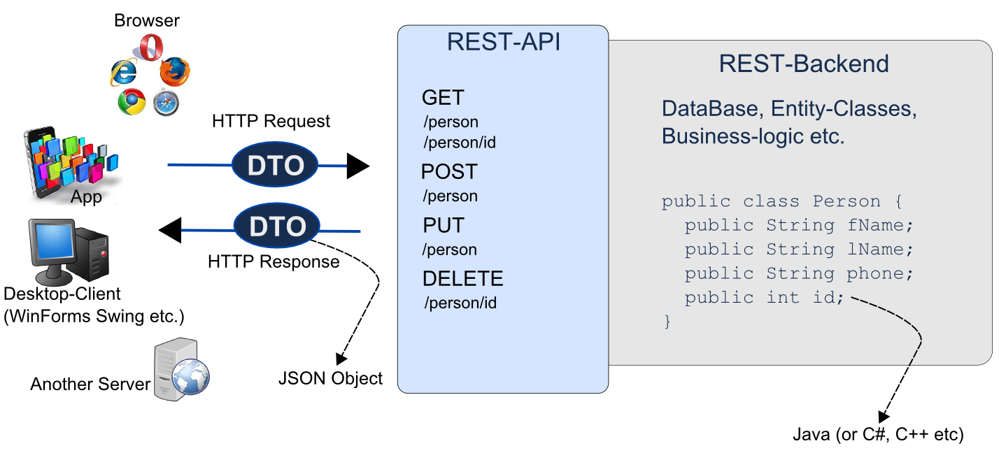
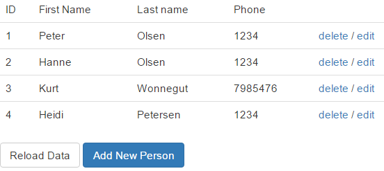
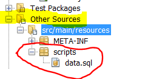
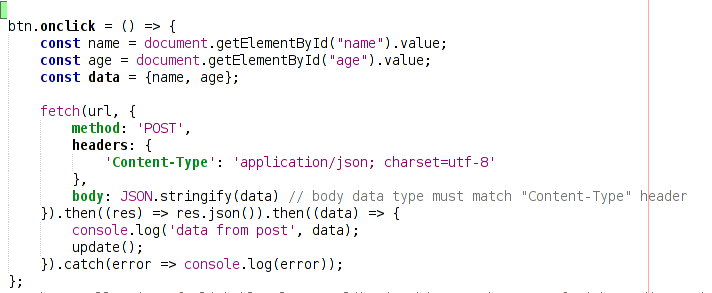

**REST with JAX RS (Persons)**

In this exercise we will go through most of the steps necessary to
create a REST driven application as sketched below, using a very simple
*one-class* model, to simplify matters.



In the backend we will implement a Java Person class and a façade that
should implement this interface:

public interface IPersonFacade **{**

```java
public interface IPersonFacade {
  Public void addEntityManagerFactory(EntityManagerFactory emf);
  public Person addPerson(Person p);  
  public Person deletePerson(int id);  
  public Person getPerson(int id);  
  public List<Person> getAllPersons();  
  public Person editPerson(Person p);  
}
```

By now, you should know that an important REST constraint is to have a
layered system, with Resources Decoupled from their Representation. For
this exercise we will expose data as JSON using the URIs given in the
figure above.

For the REST-URIs that either return or consumes a Person, the following
JSON must be used:

`{"fName":"Lolita","lName":"Nabokov","phone":"12345678","id":0}`

For the REST URI that *creates* a Person, use the JSON above, *without*
the id property:

For the GET method that returns all Persons, the JSON must have this
format:

```json
[
    {"fName":"Lolita","lName":"Nabokov","phone":"12345678","id":0},
    {"fName":"Victor","lName":"Frankenstein","phone":"23456789","id":1}
]
```

To help with the conversion between your Java backend and the JSON-based
frontend you should design a utility class as sketched below:

```java
public class JSONConverter {
  public static Person getPersonFromJson(String js){..}  
  public static String getJSONFromPerson(Person p) {..}  
  public static String getJSONFromPersons(List<Person> persons) {..}  
}
```

**Tasks**

**Server side:**

1.  Create a new NetBeans Maven Web Project

2.  Create an Entity class (with a corresponding database) to implement the Person from the figure above

3.  Create a script to setup some sample data and "call" the script from your persistence.xml file (hint-1)

4.  Implement a Façade class from IPersonFacade and use JUnit to test the Façade ( hint-2).

5.  Implement and test the JSONConverter class introduced above

6.  Implement the GET methods from the REST-API and test via a browser

7.  Implement the POST method and test using Postman

8.  Implement the PUT method and test using Postman

9.  Implement the DELETE method and test using Postman

**Client side (Self study):**

1.  Implement a read-only page to show all Persons in a table. The table must be built in the browser using plain JavaScript, and data fetched via a REST call.

2.  Add a refresh button that should refresh the page designed in the previous step. Use Postman to add a new Person to verify that we actually get an updated list (without having to create a new page on the server).

3.  Add an option to create new Persons (inspired by the figure below) on the same page as the one with the table. Use the REST API to create the new person on the server (hint-3).

4.  Add an option to delete a Person (row) as sketched on this figure (*see hint-4*)

5.  Add an option to edit a Person (row) as sketched on the figure.

**Hints**

**Hint-1 Executing a script, via persistence.xml**



*In your project, create a file createData.sql in *the exact location*
as sketched in this figure:*

*Place your script code to generated new persons into this script-file.*

*Add this line to your persistence.xml file (set the file to
drop-and-create):*

`<property name="javax.persistence.sql-load-script-source" 
value="createData.sql">`

**Hint-2 (RED) Testing a JPA Design (mocking the database)**

*Use this*
[**link**](https://docs.google.com/document/d/1txCv5GpCqsIGNn-PSq5_Qgd5_GQaixNNSQy_C6AuY8Q/edit?usp=sharing)
*for info about how to mock away the database:*

**Hint-3*:***

*For this task, you could create a Form, next to the table (visible only
when you press "Add New Person") or you could use Bootstrap to bring up
a modal with the Form
(*[**http://www.w3schools.com/bootstrap/bootstrap\_modal.asp**](http://www.w3schools.com/bootstrap/bootstrap_modal.asp)*)*

Use fetch() with post similar to this:



**Hint-4**:

*One way to do this, would be to add the person’s id as the id-value for
the anchor-tag, and a class declaration used to distinguish this link
from others (edit-links) as sketched for a single row below :*

`<a href="#" class="btndelete" id="1">delete</a>`

*Now attach a click handler to your tbody-tag and use the fact that
events, by default, bubbles up to handle all “delete-events”.*
