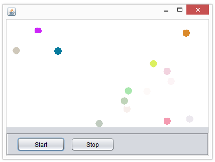

# Threads 1 getting started.

Fork (or clone, and delete the .git folder) this repository (start code
for day1+2):
[*https://github.com/Cphdat3sem2017f/startCodeForThreadExercises.git*](https://github.com/Cphdat3sem2017f/startCodeForThreadExercises.git)
to get the start code for exercises that requires start code

### Exercise 1 (create, start and end threads)

Create a program that starts 3 different parallel threads.

- **thread1**: Compute and print the sum of all numbers from 1 to 1
billion

- **thread2**: Print the numbers from 1 to 5. Pause for 2 seconds
between each print.

- **thread3**: Print all numbers from 10 and up. Pause for 3 seconds
between each print.

The program should stop thread3 after 10 seconds.

**Hint**: For the sum in thread1, use the a long data type, the result
is about 5e+17

**Hint2**: Let the main thread sleep for 10 seconds after starting
thread3. The Thread class has a static method “sleep(n)”, which takes an
integer n, and makes the calling thread sleep for n milliseconds.

**Hint3**: Use a Boolean value in the loop in thread3 to terminate task3
(let the main thread

change the value of the boolean value).

### Exercise 2

Write a function that takes an int n as parameter, and creates n
threads, running at the same time. Use a for loop to create the
threads.
Each thread should print the numbers from 1 to 100.
Have the threads print an identifier with each number, so you can see
which thread prints what (use the iteration variable from the outer loop
where the thread is created).\
**a)** describe the output. Is it what you expected?

**b)** If the threads do not interleave, can you make them, by making
the threads sleep for a short period of time? (think milliseconds).

### Exercise 3 (race condition)

The method next() in the class Even should always return an even number
(see code snippet below). You will implement a program that demonstrates
that this is not always true in a multithreaded program.

Create at least two threads, which both should call the next() method on
the same Even object and test if the return value is even. Experiment
with the number of calls each thread makes to next().
```java 
public class Even
{
    private int n = 0;
    public int next(){
        n++;
        n++;
        return n;
    }
}
```

**a)** Are you able to provoke the expected error on your machine?

**b)** How often does the problem occur?

**c)** Use the synchronization techniques you’ve learned today, to make
next() method atomic with respect to itself.

**d)** Argue that your solution is correct (argue, don’t prove)

Red only: Exercise 4 (race condition)

In your own words, explain the difference between the two java keywords
“synchronized” and “volatile”.

#### Exercise-5 (Blocking the GUI-thread) 
**GREEN**

Execute the main method in
day1.balls.BallDemo.java
What is the obvious problem with this solution?

*Hint: You might want to use the NetBeans menu-option:*

*Run -&gt; Stop Build/Run*

**a)** Solve the problem by rewriting the Ball class to extend thread,
so that the balls can be started (as shown to the right) and stopped,
and such that one can terminate the program by pressing the cross

**b)** Transform your observations from this example into a general rule
about “lengthy” operations in the GUI threads (not only SWING and Java,
but all GUI-frameworks)

**c)** Classify the problem you solved, using threads in this example.

**d)** Will it still solve the problem, if the computer executing the
code, had only one kernel?

**e)** Consider how/if you could solve this problem in a single-threaded
environment (think JavaScript)
