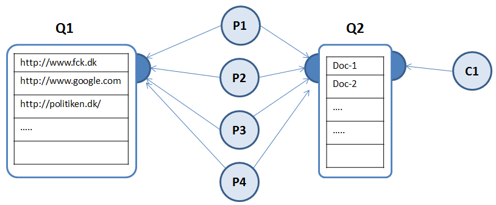
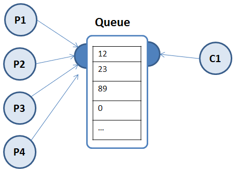

# Threads day 2 - producer / consumer problem

# Initial setup
Fork (or clone, and delete the .git folder) this repository (same as for
day-1):[*https://github.com/Cphdat3sem2017f/startCodeForThreadExercises.git*](https://github.com/Cphdat3sem2017f/startCodeForThreadExercises.git)
to get the start code for exercises below

Exercise-1 (Basic Threads, and measuring performance)

*Why is this exercise green? It’s green because it assumes you did the basic thread exercises from day-1. If, then there is really nothing new in this exercise, except that the problem is a “bit more realistic”.*

Use the start code in webscraper for this exercise. The example uses a
library jsoup (see the pom-file) to web-scrape information from 3
different web-pages.

This library abstracts away most of the details with performing a
programmatically request up against a web site and parse the received
HTML.

Since accessing a remote URL involves a lot of blocking (we will talk
more about this in later weeks), the main purpose with this exercise is
to see whether there is any (performance) benefit in performing the
three request via three separate threads.

**a)** Run the main method in the Tester class, and make sure you understand
conceptually what happens. Especially you should note that these lines :
tcn.run() probably takes a noticeable amount of time (why?)

**b)** Refactor the TagCounter class to extend the Thread class. This should be
very simple (why ?)

**c)** Change the Tester class to not call run(), but start the three threads (what's the **BIG difference**?)

- This will most likely mean that all your system.out’s will be empty or null (why?)
- Fix the problem to show content in the system.out’s

**d)** Let's see whether we gained anything by executing the three calculations
in parallel, or if we could have achieved the same result via sequential
execution.

First lets see how many Kernels your system offers. Add this line to the
beginning of your main():

System.out.println("Available Processors: " +
Runtime.getRuntime().availableProcessors());

Use the following skeleton to measure execution time for **sequential**
execution (observe that we are calling the **run()** method, not start()
to get sequential execution (one more time, make sure you understand the
**BIG difference**).:

```java
long start = System.nanoTime();
tc1.run();
tc2.run();
tc3.run();
…
long end = System.nanoTime();
System.out.println("Time Sequential: "+(end-start));
```

Now use the same principle to measure execution time for parallel execution (don't get the end time before all threads has stopped)

Explain the results

### Exercise 2

*This exercise is marked as Green because of the amount of provided code and hints. At the exam, you could be asked to complete something
similar, with none or very little start code. In order to understand this exercise, you must have completed exercise-1 given above.*

Exercise 1 can easily be improved to be much more generic. This can be done in several ways, here we will use a Producer-Consumer solution using a BlockingQueue implementation.
We will change exercise-1 as follows:

-   Instead of the hardcoded 3 URL’s we will introduce a Queue (Q1 below) which initially should include all the url’s we want to use.

-   The TagCounter class in exercise-1 did two things. It fetched the remote page and created a Document instance from the URL. After that it read the tags from the Document as sketched below:

//Get a Document instance representing the web-page

doc = Jsoup.connect(url).get();

// Do a lot of “stuff” with the doc

-   We will change this in a way where you should start four Producer threads (why four, and is four always the right choice?), which should should retrieve, and remove, a url-string from Q1, use the Jsoup-library to fetch and create a Document and put this Document into Q2. If Q1 is empty (no more urls) the thread should terminate.

-   Yet another thread C1 (the Consumer) should take the Documents from Q2, read the title, and the number of Divs. When all Documents are read, and not before, it should print: all titles+the number of divs for each title, followed by the sum of all div’s



**a)** Execute the Tester code in day2.webscrapprodcon. It should
compile and run, but don’t do “anything”. Make sure you understand how
the provided code maps to the diagram and text above.

**b)** Complete the class DocumentProducer (look for the TODO’s). Again;
first make sure you understand it’s purpose in the descriptions given
above.

**c)** Complete the class DocumentConsumer (look for the TODO’s)

**d)** Note the order in which the consumer prints the results.

1. Is this the order, in which we added the URL’s to Q1?
2. If not, explain why?
3. (Red) If not, can you print results in the right order?

Day-3 will provide you a way to “return” values from your threads and control the order

**e)** Step c) gave you a hint of how to let the consumer could detect that all
producers were done.

This was not very efficient however, since we always would have to wait 10 (unnecessary) seconds before we are done.

Come up with a way (for example via a shared and synchronized object) to let the Producers indicate that there are no more items to produce.

## (YELLOW) Exercise 3 (Producer-Consumer)

In this exercise you must create a simple Producer-Consumer design, with
a number of producers which create random numbers, which are consumed by
a single consumer process. Neither the producer or consumer class works
as intended in the code you are
given.

This figure illustrates what you have to implement.
- P1-P4 represents four Producer Threads, each producing a number of random numbers.
- Producers place all produced numbers in a shared data structure “Queue” (implemented via a BlockingQueue implementation). A single Consumer Thread consumes all the produced Numbers.

**a)** Before you start you should understand the general idea, behind the
exercise as described above by answering the following questions (write
down your answers, as comments in the code).

1.  If we need a “large” collection of random numbers, what is the advantage (if any) of introducing a number of threads to “produce” the numbers?

2. Why does the exercise suggest 4 producer threads, and is this always the right number?

3. Given that the Queue is a BlockingQueue implementation, how would you insert data into the Queue (add(), offer(), put() ) if it’s limited in capacity, and items are produced much faster than they are consumed] (Think: what happens when you insert into a full queue)?

4. Given that the Queue is a BlockingQueue implementation, how would you fetch data from the Queue (remove(), poll(), take() ) if Production is slow, compared to how we consume items

**b)** Use the code provided in rndnumberprodcon as start code for this
exercise. Compile and run the main method in Tester.

**c)** Complete the run() method in the RandomNumberProducer class, by
producing the required number of random numbers and insert them into the
numbersProduced Queue (again, chose the right insert method).

**d)** Complete the run() method in the RandomNumberConsumer class so that
the sumTotal variable is updated, and all consumed numbers are inserted
into either the below50 or aboveOr50 Lists.

**e)** Run and “verify” the behaviour of the completed program

Exercise 4 (Deadlock detection)

Execute the code in the package
[*deadlock*](https://github.com/Cphdat3sem2017f/startCodeForThreadExercises/tree/master/src/main/java/day2/deadlock).

The program contains a class; `ResourceContainer` that contains the
following two lists:
```java
List<String> words = new ArrayList();
List<Integer> numbers = new ArrayList();
```

Multiple concurrent threads needs to add data to these lists without
interference from other threads.The pattern for use is as follows:

- A list is available from a thread by calling `getResourceWords()` which returns the first list and then sets a lock (Lock) so subsequent calls from other threads will be blocked.

- After use of the list the lock is released by calling ReleaseResourceWords ()

**a)** Does the program behave as expected, if not explain the problem.

**b)** If not try to detect the emergence of a deadlock, see below.

All JVMs have a single implementation of the interface ThreadMXBean containing relevant thread monitoring methods.

Add the following class to the project and complete it so that it prints
“DeadLock Detected”
```java
class DeadLockDetector extends Thread {

  ThreadMXBean bean = ManagementFactory.getThreadMXBean();
    
  public void run() {
    while (true) {
      long[] threadIds = bean.findDeadlockedThreads();
      //...
    }
  }
}
```

Create an instance of the class, start the thread (in the beginning of
the main method) and observe if a deadlock is detected.

Yellow **c)** Identify the problem in the code?

**Yellow** **d)** If this revealed a deadlock:
1. Solve the problem
2. Explain the strategy used to solve the problem

## Exercise 5 (Deadlocks - Dining Philosophers) 


This exercise is harder than the other exercises, so take it as a
challenge, if you just can't get enough (red, (yellow))

The start code can be found on github:
[*https://github.com/Cphdat3sem2018f/week1-threads/blob/master/code/DiningPhilosophers*](https://github.com/Cphdat3sem2018f/week1-threads/blob/master/code/DiningPhilosophers)

Create a new plain Java Maven Project, and add the
**DiningPhilosophers** class to the
project.

It is a simulation of the classic concurrency problem “Dining Philosophers”

Five philosophers sits at a round table and don't do anything else than either eat or think. In order to eat a philosopher *must have* two chopsticks (left and right).

**a)** Execute the code and see if "it fails" (The code might have to run for
some time to see the problem)

**b)** Add the necessary code to detect a deadlock. If a deadlock is detected
the program must report to the console and shut down (System.exit(1)).

**c)** The solution above (nuking all five philosophers) were probably a bit
drastic.

Try to locate the problem with the supplied code, and rewrite the
program in a way so that a deadlock cannot occur.

**d)** Add a description about how you solved the problem (the strategy).

**e)** Try to solve the problem in more than one way, using each of the three
strategies for dealing with deadlocks:
1. **Detect and Recover** : Let the Deadlock occur - and place reliance on the ability to detect the fact and recover from it.
2. **Avoid Deadlocks** : Anticipate an impending deadlock and take avoiding actions in advance
3. **Prevent Deadlocks** : Eliminate one or more of the conditions necessary for a deadlock to occur.

Hints (for the last strategy):
- Remove one of the four necessary conditions for a deadlock, and you have solved the problem (see end of slides for day-2)
- You don't need to understand each and every line in the code to solve the problem. Take a look at a philosopher's run-method, and see whether that could inspire you to a change:
```java
while (true) {
	think();    
	pickUpLeftChopstick();
	pickUpRightChopstick();
	eat();
	putDownChopsticks();
}
```
https://docs.oracle.com/javase/7/docs/api/java/util/concurrent/BlockingQueue.html
