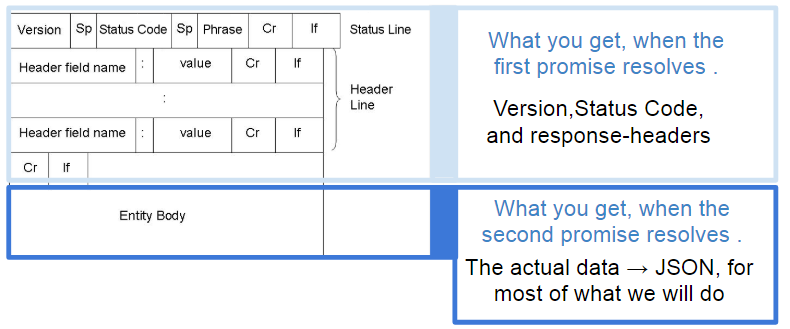

# AJAX with Promises

Without having to install external API’s, there are only two ways to
make AJAX-requests in a browser:

-   The old, and original way, using the XMLHttpRequest method (works in all browsers)

-   Using Fetch which is included in all newer browsers

The biggest difference between the two is, that fetch is using promises,
which is the modern and recommended way, to handle asynchronicity in
JavaScript.

Fetch is a bit tricky to use, in cases where error-response for 4xx and
5xx errors are supplied as a JSON-response, but the following will
suggest a possible solution, and we recommend fetch as the API to use.

Promises
--------

We not will dig deep into the promise-API this semester, but as a
minimum, you should know that a *JavaScript Promise object represents
the eventual completion (or failure) of an asynchronous operation and
its resulting value.* Think of a Promises as the JavaScript counterpart
to Java’s Futures.

For this semester you need to know the fundamentals of promises since
fetch is using, and returns, promises.

Fetch and Promises
------------------

The following will focus on fetch up against a REST-API returning the
response as JSON (OK-responses, as well as ERROR-responses). Obviously,
you can use fetch with other kinds of responses.

A basic fetch (GET) request looks like this:

```javascrip

fetch('https://swapi.co/api/people/1')

.then(function(response) {

return response.json();

})

.then(function(data) {

console.log(data.name);

});
```

This example uses chaining, which is normal, but at first it can be hard
to see “where the promises are”. The example below, does exactly the
same as above, but stores the two involved promises (promise1+promise2)

```javascript

const promise1 = fetch('https://swapi.co/api/people/2');

const promise2 = promise1.then(function(response) {

return response.json();

})

promise2.then(function(data) {

console.log(data.name);

});

```
At first, it can be confusing why we need to have two promises involved
(two .then(...)’s), but if you use your knowledge of the HTTP protocol,
it should actually make sense.

The figure below illustrates a normal HTTP-response, which as always,
first include version, status code and all the response headers. This is
what you get when the first promises *resolves*.



Secondly, we get the body of the request which could be HTML, if the
request was for an HTML-page, CSS if the request was for a style-sheet
page or JSON if that was what was returned with the response.

What you can see from the figure above is, that if you need access to
*Headers* or the *status code* you *need to do this* when the first
promise resolves. If/when you want access to the body, you must call one
of the methods on the first response, i.e. res.json() to return a new
promise with the parsed JSON. See this
[*link*](https://developer.mozilla.org/en-US/docs/Web/API/Response) for
alternative methods to call if the body contains content, other than
JSON.

### Fetch, with POST, PUT and DELETE 

For requests other than GET, you need to provide fetch with an object
containing the *options* for the request you are going to make. As an
example, this is how you could make a POST request:
```javascript

let **options** = {

method: "POST",

headers: {

'Accept': 'application/json',

'Content-Type': 'application/json'

},

body: JSON.stringify({

age: 34,

name: "lis Benson",

gender: "female",

email: "lis@lis.com"

})

}

fetch("http://localhost:3000/users",**options**);

```
Replace method in *options* above, with the actual request-method you
need (PUT, DELETE). For more info read
[*here*](https://developer.mozilla.org/en-US/docs/Web/API/Fetch_API/Using_Fetch#Supplying_request_options).
Please observe, that what you include for the request is (obviously)
similar to how you would make the request using Postman.

### Error Handling with fetch

A problem, which has annoyed many developers is that fetch only rejects
a promise when “*a network error is encountered, although this usually
means permissions issues or similar.*”

When a promise is rejected we can “catch” it as sketched below (using
arrow notation for simplicity)
```javascript
fetch('https://swapi.co/api/people/999999999999')

.then(res=&gt; res.json())

.then(data =&gt; console.log(data.name))

**.catch(err =&gt;console.log("UPPS"));**
```

This request returns a JSON response like this {"detail": "Not
found"}and the status code **404**. But as explained above, this
http-error is not considered an error by fetch, so the example above,
will not “catch” the error.

In order to handle this error (and HTTP-errors in general), and also get
the error-response, we have to hook into the first then-method and check
the status code. If we want to “catch” the error, in a way, with access
to the json-error, it can then be done like sketched below:
```javascript
fetch('https://swapi.co/api/people/999999999999')

.then(res=&gt; {

**if(!res.ok){ //OK is false for statuscodes &gt;= 400**

**return Promise.reject({status: res.status, fullError: res.json() })**

**}**

return res.json();

})

.then(data =&gt; console.log(data.name))

.catch(err =&gt;{

**if(err.status){**

**err.fullError.then(e=&gt; console.log(e.detail))**

**}**

else{ console.log("Network error"); }

})
```

If you like this strategy (i.e. you cannot come up with something better
;-) you can create a helper function and use it for ALL your
fetch-request (assuming the backend supply errors as json)

```javascript
function **handleHttpErrors**(res){

if(!res.ok){

return Promise.reject({status: res.status, fullError: res.json() })

}

return res.json();

}

fetch('https://swapi.co/api/people/999999999999')

.then(**handleHttpErrors**)

.then(data =&gt; console.log(data.name))

.catch(err =&gt;{

if(err.status){

err.fullError.then(e=&gt; console.log(e.detail))

}

else{console.log("Network error"); }

});

```
*See the hints section on next page, for “smart” tricks, to make fetch
easier to use.*

Fetch utility methods.
----------------------

This page contains some small utility functions to make your life with
fetch more “fun”

#### Utility method for POST, PUT and DELETE requests

Remember, for requests other than GET, you need to provide an *options*
object to fetch.

This small method (refer to the spec, for additional properties you can
set):
```javascript
function makeOptions(method, body) {

var opts = {

method: method,

headers: {

"Content-type": "application/json"

}

}

if(body){

opts.body = JSON.stringify(body);

}

return opts;

}
```

can make the POST request from our previous example as simple as this:

const data = {age: 34,name: "lis Benson", gender: "female",email:
"lis@lis.com"};

`const **options** = **makeOptions**("POST",data);`
```
fetch("[*http://localhost:3000/users",*](http://localhost:3000/users%22,options)[***options***](http://localhost:3000/users%22,options));
```

#### Utility Method to handle http-errors with fetch

*This is the same as was introduced earlier in the section “Error
handling with fetch”*
```javascript
function **handleHttpErrors**(res){

if(!res.ok){

return Promise.reject({status: res.status, fullError: res.json() })

}

return res.json();

}

fetch('https://swapi.co/api/people/999999999999')

.then(handleHttpErrors)

.then(data =&gt; console.log(data.name))

.catch(err =&gt;{

if(err.status){

err.fullError.then(e =&gt; console.log(e.detail))

}

else{console.log("Network error"); }

});

```

Ref:
[*https://developer.mozilla.org/en-US/docs/Web/API/Fetch\_API*](https://developer.mozilla.org/en-US/docs/Web/API/Fetch_API)
