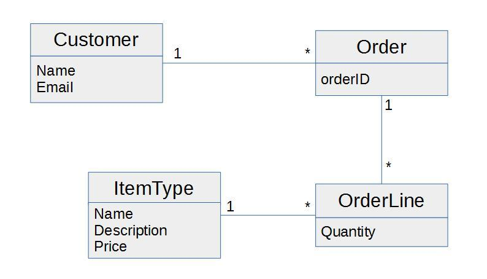

# Object Relational Mapping with JPA 

### General part

- *Describe how you have handled persistence in the last three semesters. The considerations should include all relevant layers. File IO, Relational Databases, local storage and cookies in browsers.*
- *Explain the rationale behind the topic Object Relational Mapping and the Pros and Cons in using a ORM*
- *Explain the JPA strategy for handling Object Relational Mapping and important classes/annotations involved.*
-*Outline some of the fundamental differences in Database handling using plain JDBC versus JPA*

### Practical part

The model below is an initial model for a system than can handle orders.
An order refers to a customer and a number of order lines. Each order
line has a quantity and it refers to an item type. The item type has a
name, a description and a price. The price for each order line is the
quantity times the price. The total price for an order is the sum of all
its order lines.

1)  Examine and understand the diagram.  

2. Get started
- Create a Maven Java Application with NetBeans, and 
- create the database tables
- use Object Relational Mapping (JPA) to implement the corresponding OO classes.

3. Create a façade implement as many of the methods below as you have time for (not necessarily in the given order):

- Create a Customer (insert a few customers) 
- Find a Customer
- Get all Customers
- Create an Order (insert a few orders)
- Add an Order to a Customer
- Find an Order
- Create an ItemType (insert a few ItemTypes)
- Create an OrderLine (insert a few orderLines)
- Find all orders by a specific customer (preferably use jpql)
- Find the total price of an order (preferably use jpql )
- Use jpql's `select new CustomerDTO...` to select and transform all customers to CustomerDTO with an array of order id's (Instead of the List<OrderEntity>).

#### hint-1
You don't necessarily need to implement all Entity-classes before
you start on part-3. Make sure to implement some of the methods in part-3 before you stop).
