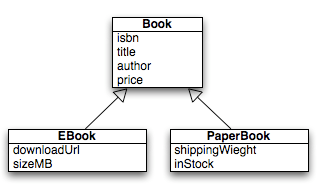

# Object Relational Mapping and Inheritance with JPA 

### General part

- *Describe how we have handled persistence in the lastthree semesters. The considerations should include all relevant layers. File IO, Relational Databases, the browsers local storage and cookies on the browser.*

- *Explain the JPA strategy for handling Object Relational Mapping and important classes/annotations involved*

- *Explain how Inheritance in an OO language can be mapped to tables in a relational database*

- *Explain (at least two) JPA-strategies for Inheritance Mapping*

### CA or Semester Project
For a real exam exercise, this will be a small part where you are expected to talk, in about 5 minutes, about one of the semester CA’s or the semester project (related to the topic for this question).

### Practical part
We need JPA mappings for this domain:  

It models a naive implementation of Book-types for a Web-Book store

Create a Maven Java Application with NetBeans and design a JPA solution
that implements:

- The Book Entity class (use isbn as id/primary key).

- The sub Entity Classes EBook and PaperBook. You decide which inheritance model to use, but you must argue for your choice and explain all columns in the corresponding tables.

- Make a small program that shows the four CRUD operations involving all classes.

- Makes sure to demonstrate, polymorphism in one of the examples above (fetch all Books, iterate over the collection and explain the result)

**Explain:** If you would add this annotation `@Column(nullable = false)`
on top of for example the downloadUrl field, which Inheritance Strategy
would fail if you actually tried to insert a Book or a PaperBook)
