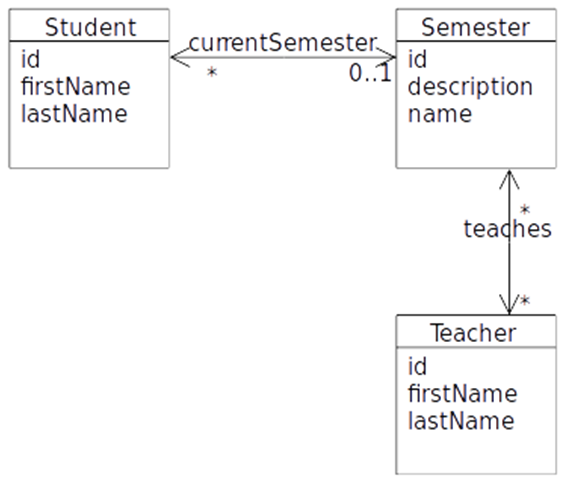

# Object Relation Mapping and JPQL


### General part

-  *Explain the rationale behind the topic Object Relational Mapping and the Pros and Cons in using a ORM*.

- Discuss how we usually have queried a relational database

-  Discuss the methods we can use to query a JPA design and compare with what you explained above

### CA or Semester Project

For a real exam exercise, this will be a small part where you are expected to talk, in about 5 minutes, about one of the semester CA’s or the semester project (related to the topic for this question).

### Practical part start
 (requires the [script:](####script))

**This exercise requires you to setup a MySQL database as described
below:**

-   Create a new MySQL database ****jpqlexam****, either from within Netbeans or using MySQL Workbench.
-   Create a new Maven java project with NetBeans.
-   In this project create a folder **scripts** and inside it create a file called: *Jpqlexam.sql*. and paste the sql script into the file. Execute the script.

This script creates four tables which simulates a very simple semester
system with students, teachers and semesters, as sketched in this model.   
The script inserts 6 students,3 semesters and 3 teachers, and assigns relationships between them.

**A.** Use NetBeans to create the matching Entity Classes.

**B.** Investigate the generated Entity classes and observe the NamedQueries
generated by the Wizard.

**C.** Create the Dynamic Queries (or if possible, a named Query generated by the wizard) to solve the following problems:

1. **Find** all Students in the system
2. **Find** all Students in the System with the first name Anders
3. **Insert** a new Student into the system
4. **Assign** a new student to a semester
5. **Find** all Students in the system with the last name And
6. **Find** the total number of students, for a semester given the semester name as parameter.
7. **Find** the total number of students in all semesters.
8. **Find** the teacher who teaches the most semesters.

#### script
```sql
CREATE DATABASE  IF NOT EXISTS `ExamPreparationJPQL`
USE `ExamPreparationJPQL`;

DROP TABLE IF EXISTS `TEACHER_SEMESTER`;
DROP TABLE IF EXISTS `STUDENT`;
DROP TABLE IF EXISTS `TEACHER`;
DROP TABLE IF EXISTS `SEMESTER`;


CREATE TABLE `SEMESTER` (
  `ID` bigint(20) NOT NULL AUTO_INCREMENT,
  `DESCRIPTION` varchar(255) DEFAULT NULL,
  `NAME` varchar(255) DEFAULT NULL,
  PRIMARY KEY (`ID`)
) ENGINE=InnoDB AUTO_INCREMENT=4 DEFAULT CHARSET=latin1;

INSERT INTO `SEMESTER` VALUES (1,'Computer Science 3. sem','CLcos-v14e'),(2,'Datamatiker 3. sem','CLdat-a14e'),(3,'Datamatiker 3. sem','CLdat-b14e');


CREATE TABLE `STUDENT` (
  `ID` bigint(20) NOT NULL AUTO_INCREMENT,
  `FIRSTNAME` varchar(255) DEFAULT NULL,
  `LASTNAME` varchar(255) DEFAULT NULL,
  `CURRENTSEMESTER_ID` bigint(20) DEFAULT NULL,
  PRIMARY KEY (`ID`),
  KEY `FK_STUDENT_CURRENTSEMESTER_ID` (`CURRENTSEMESTER_ID`),
  CONSTRAINT `FK_STUDENT_CURRENTSEMESTER_ID` FOREIGN KEY (`CURRENTSEMESTER_ID`) REFERENCES `SEMESTER` (`ID`)
) ENGINE=InnoDB AUTO_INCREMENT=7 DEFAULT CHARSET=latin1;

INSERT INTO `STUDENT` VALUES (1,'Jens','Jensen',1),(2,'Hans','Hansen',2),(3,'John','Doe',3),(4,'Jane','Doe',3),(5,'Andersine','And',2),(6,'Anders','And',1);


CREATE TABLE `TEACHER` (
  `ID` bigint(20) NOT NULL AUTO_INCREMENT,
  `FIRSTNAME` varchar(255) DEFAULT NULL,
  `LASTNAME` varchar(255) DEFAULT NULL,
  PRIMARY KEY (`ID`)
) ENGINE=InnoDB AUTO_INCREMENT=4 DEFAULT CHARSET=latin1;

INSERT INTO `TEACHER` VALUES (1,'Sofus','Albertsen'),(2,'Thomas','Hartmann'),(3,'Lars','Mortensen');


/*!40101 SET @saved_cs_client     = @@character_set_client */;
/*!40101 SET character_set_client = utf8 */;
CREATE TABLE `TEACHER_SEMESTER` (
  `teaching_ID` bigint(20) NOT NULL,
  `teachers_ID` bigint(20) NOT NULL,
  PRIMARY KEY (`teaching_ID`,`teachers_ID`),
  KEY `FK_TEACHER_SEMESTER_teachers_ID` (`teachers_ID`),
  CONSTRAINT `FK_TEACHER_SEMESTER_teaching_ID` FOREIGN KEY (`teaching_ID`) REFERENCES `SEMESTER` (`ID`),
  CONSTRAINT `FK_TEACHER_SEMESTER_teachers_ID` FOREIGN KEY (`teachers_ID`) REFERENCES `TEACHER` (`ID`)
) ENGINE=InnoDB DEFAULT CHARSET=latin1;
/*!40101 SET character_set_client = @saved_cs_client */;


INSERT INTO `TEACHER_SEMESTER` VALUES (1,1),(3,1),(1,2),(2,2),(1,3),(2,3),(3,3);

```