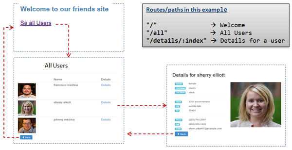

# React with routing


**General part**
- Describe the term Single Page Application and why it relevant for modern web-applications
- Describe how SPA's are implemented with React
- Explain about Routing in React

**Practical part**

The task is to create a small application with three routes and matching
views (there is no “top-menu” in this example). The app must have an
initial view with a welcome message + a Link to a view that renders a
list of all users. When "details" are pressed it must present a details
view for the selected user. This is all sketched in the figure below.

The data sample provided on next page include links to fetch both a
*thumbnail* and a *full size picture* for all
users.

*Complete the exercise following these steps* (don't consider styling,
until all components/routes are implemented):

**1)** Create a new project with create-react-app and import required
dependencies in App.js as:
`Import {BrowserRouter as Router, Route, Link, Switch} from
"react-router-dom"`

**2)** Paste the json formatted data into a file: `data/data.json`. Read
data into your App component like this:
`import data from "./data/data.json"`

**3)** In App.js, add this to the Render method:
```xml
<Router>
  <Switch>
	//Add Your Routes here
  </Switch>
</Router>
```

**4)** Implement the Welcome Component (consider whether it should be a
class or a functional Component), and the Route- handler to forward
requests to this page (use the paths, given in the figure above)

**5)** Implement the All users Component and the Route-handler that will
lead to this view.

**6)** Implement the Details Component and the Route-handler that will
lead to this view

**7)** When everything works as expected, style the application (not
necessarily as on the screenshots above).

*Data for the exercise (paste into a file **data.json**, in a folder
**data**)*:
```json
{
  "users": [
    {
      "gender": "male",
      "title": "mr",
      "first": "francisco",
      "last": "medina",
      "street": "2748 w dallas st",
      "city": "flowermound",
      "state": "new jersey",
      "zip": "77511",
      "email": "francisco.medina65@example.com",
      "dob": "454252284",
      "phone": "(757)-889-2571",
      "cell": "(113)-542-2123",
      "picture": {
        "large": "http://api.randomuser.me/portraits/men/22.jpg",
        "thumbnail": "http://api.randomuser.me/portraits/thumb/men/22.jpg"
      }
    },
    {
      "gender": "female",
      "title": "mrs",
      "first": "sherry",
      "last": "elliott",
      "street": "3251 brown terrace",
      "city": "wichita falls",
      "state": "washington",
      "zip": "79455",
      "email": "sherry.elliott17@example.com",
      "dob": "224238139",
      "phone": "(225)-793-2067",
      "cell": "(968)-555-1402",
      "picture": {
        "large": "http://api.randomuser.me/portraits/women/37.jpg",
        "thumbnail": "http://api.randomuser.me/portraits/thumb/women/37.jpg"
      }
    },
    {
      "gender": "male",
      "title": "mr",
      "first": "johnny",
      "last": "medina",
      "street": "1313 samaritan dr",
      "city": "redding",
      "state": "new hampshire",
      "zip": "43269",
      "email": "johnny.medina76@example.com",
      "dob": "259176886",
      "phone": "(991)-957-7139",
      "cell": "(502)-773-1487",
      "picture": {
        "large": "http://api.randomuser.me/portraits/men/90.jpg",
        "thumbnail": "http://api.randomuser.me/portraits/thumb/men/90.jpg"
      }
    }
  ]
}
```
