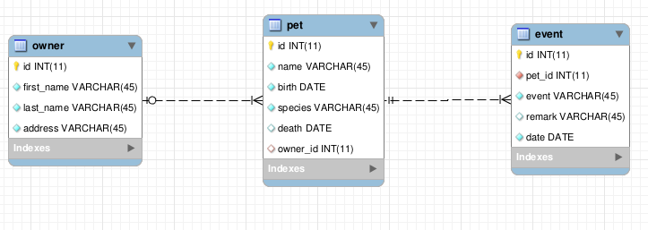

# REST and REST APIs


### General part
- Elaborate on some of the characteristics of REST, like: Stateless, Cacheable, Layered System, Uniform Interface etc.
- Explain the benefit(s) from having a backend that exposes all data to clients via a REST-API
- Elaborate on how JSON or XML supports communication between subsystems, even when the subsystems are implemented on different platforms.

### Practical part 
(requires the script below in this document *+ gson
dependency*)

The starting point for this exercise is a pet hospital example database.

The script sets up the database with the three tables sketched in this
diagram, and data for different animals, owners and
events


**Getting Started:**
- Create a new NetBeans Web project as the starting point for this exercise

- Execute the script *pethospital.sql* from MySQL Workbench, to setup the database

- Use the NetBeans Wizard to create a set of matching Entity-classes

**Tasks** (All transfer of data between the API and Clients must be encapsulated in JSON)

1.  Implement a simple facade class with a method that will **return all Pet**'s, and demonstrate the method
2.  Implement a Rest service to **get the total Number of pets** formatted like: `{"petCount":4}` (just call `size() `on the result from
    the method above)
3.  Use the method from 1) to implement a REST service to **get a json-list of all pets**, with *id*, *name*, *birth, species* and the
*first\_name* and *last\_name* of the owner

Implement as many as you have time for of the following REST endpoints
1.  Get a list of **all living pets**.
2.  Get a list of all pets that had an **event on a given day**
3.  **Create a new event** for an existing pet

For each service you should: Define the API call (URI) and the (JSON)
format used to transfer data back and forth between Client and Server.

Test the REST API using a browser for the GET methods and Postman for
the POST method (or Rest Assured if you prefer).

If you have time: create an HTML page that could fetch and show data
(using javascript or react) for some of the methods created above.

```sql
CREATE DATABASE  IF NOT EXISTS `PetHospital` /*!40100 DEFAULT CHARACTER SET latin1 */;
USE `PetHospital`;
DROP TABLE IF EXISTS `event`;
DROP TABLE IF EXISTS `pet`;
DROP TABLE IF EXISTS `owner`;
CREATE TABLE `owner` (
  `id` int(11) NOT NULL,
  `first_name` varchar(45) NOT NULL COMMENT '	',
  `last_name` varchar(45) NOT NULL,
  `address` varchar(45) NOT NULL,
  PRIMARY KEY (`id`)
) ENGINE=InnoDB DEFAULT CHARSET=latin1;
INSERT INTO `owner` VALUES (1,'Jens','Andersen','Mimersgade 143'),(2,'Arne','Hansen','Strandvejen 12'),(3,'Hanne','Jensen','Oluf Palmes Allé 98 1. th');

CREATE TABLE `pet` (
  `id` int(11) NOT NULL AUTO_INCREMENT,
  `name` varchar(45) NOT NULL,
  `birth` date NOT NULL,
  `species` varchar(45) NOT NULL,
  `death` date DEFAULT NULL,
  `owner_id` int(11) DEFAULT NULL,
  PRIMARY KEY (`id`),
  KEY `owner_idx` (`owner_id`),
  CONSTRAINT `owner` FOREIGN KEY (`owner_id`) REFERENCES `owner` (`id`) ON DELETE NO ACTION ON UPDATE NO ACTION
) ENGINE=InnoDB AUTO_INCREMENT=5 DEFAULT CHARSET=latin1;
INSERT INTO `pet` VALUES (1,'Fiddo','2015-02-01','Dog',NULL,1),(2,'Hannibal','2013-05-10','Dog',NULL,1),(3,'Elvis','2010-08-08','Cat',NULL,3),(4,'Sam','2012-01-05','Rabbit','2015-07-07',2);


CREATE TABLE `event` (
  `id` int(11) NOT NULL AUTO_INCREMENT,
  `pet_id` int(11) NOT NULL,
  `event` varchar(45) NOT NULL,
  `remark` varchar(45) DEFAULT NULL,
  `date` date NOT NULL,
  PRIMARY KEY (`id`),
  KEY `pet_idx` (`pet_id`),
  CONSTRAINT `pet` FOREIGN KEY (`pet_id`) REFERENCES `pet` (`id`) ON DELETE NO ACTION ON UPDATE NO ACTION
) ENGINE=InnoDB AUTO_INCREMENT=4 DEFAULT CHARSET=latin1;
INSERT INTO `event` VALUES (1,4,'Death','Died of age','2015-07-07'),(2,2,'Broken bone','Ribbs broken','2015-02-08'),(3,3,'Medicine','Antibiotics for wound on back leg','2015-03-10');
```