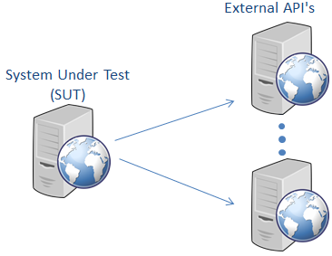

# Test and Mocking with JUnit, Mockito and RestAssured

### General part
- Explain fundamental topics related to software testing like "test first" vs. "test after"
- Explain the basics of writing JUnit-tests
- Explain about strategies/frameworks to unit test code, with complex dependencies

- Explain the topics: State Verification vs Behaviour Verification and relate to examples i the code

- Explain why testers “just love” the Dependency Injection Pattern

*In this exercise you must first refactor un-testable code into
something you can test, and then use JUnit and Mockito to verify both
state and behaviour of the SUT (System Under Test).*

### Practical part

Imagine a real-life system like Momondo where you can search for tickets
from almost all airlines out there.

Such a system will probably have an architecture similar to this (with
the SUT being Momondo).

For such a system, there will most likely be a way to (automatically)
warn an administrator, if an external API, for whatever reason, is
failing.

The start code for this project, provides a very simple proof of concept
solution for such an architecture, with only one external server, and it
is Jokes, not flight-tickets we are fetching ;-). The system will send a
“mail” if the remote API is not responding.

### Getting started clone or fork start code from [here](https://github.com/Dat3SemStartCode/exprep_test_mock.git)

**1)** Build the project, and execute the Fetcher class’s main method to
see the output.

Try and change the URL, and execute again. You should see this output:

`#####################################################################################

This simulates that a REAL EMAIL was sent to: admin@jokes.com with this text:
There is a problem with the server: http://api.icndb.com/jokes/random
#####################################################################################`

It simulates that an email has been sent. Interpret it as that a *real email was sent*.

**2)** Include the required dependency to your pom-file to use Mockito

**3)** The class has two *hidden* dependencies (which). Refactor these
dependencies out, into two separate classes using the dependency
injection pattern and inject these dependencies via a new constructor
(this will allow us to provide mocks).

**4)** Implement a test that verifies we get a Joke from the underlying
request, but use a mock so your test does not require network access.

Verify the expected result, and also that methods on dependencies were
called correctly

**5)** Implement a test that verifies the expected exception and an
email was sent for a failing server (without actually sending the mail).

**6)** Implement a simple Rest service which used like this
`api/jokes/getourstolenjoke` will return a JSON response with the Joke
fetched from the original joke

**7)** Implement a *simple integration* test which should verify the
functionality of our new REST service
