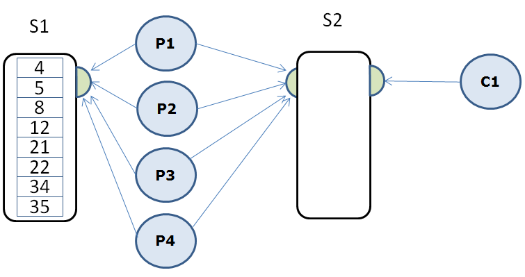

# Thread Programming


### General part

Write 1-5 lines of text for each bullet:

- When and why will we use Threads in our programs
- What is the Race Condition Problem and how can you solve it?
- Explain the Producer/Consumer-problem and how to solve it in modern Java Programs
- Explain what Busy Waiting is and why it's a bad thing in a modern software system.
- Describe Java's *BlockingQueue* interface, relevant implementations and methods relevant for the producer consumer problem.

### Practical part

For this exercise, we will use the Fibonacci implementation to calculate Fibonacci numbers. The Fibonacci number itself is not interesting for this task, only the fact that the execution time for the algorithm grows
exponentially with the number passed in.

#### Implement the following design:


1.  A thread (in this case the main-thread) must initially fill a shared
data structure S1 with numbers from which the corresponding Fibonacci numbers should be calculated.

```java 
private long fib(long n){
    if((n==0)||(n==1)){
        return n;
    } else {
        return fib(n-1)+fib(n-2);
    }
}
```

2. The Main thread should start the four Producer threads (P1 - P4),
that all uses the shared data structure S1 to retrieve values for which they should calculate the corresponding Fibonacci number. When a thread has finished the calculation, it should add the result to the shared data structure S2, and continue with the next number in S1. If S1 is empty, the producer should stop (not sleep or wait).

3. Just after the main thread have started the four Producer threads, it should start the Consumer-thread C1, which continuously retrieves
the calculated figures, prints them to the console and keep track of the total sum.

4.  When all threads have finished their jobs, print the sum of all the
    calculated Fibonacci numbers.

5.  Refactor all code in to a method which takes the number of Producer threads to use as an argument. Execute the method with 1, 2, 3, and 4 as argument. Calculate the time it takes for each execution and explain (as well as you can) the result.

**Hints**:

1. Initialize S1 with the following numbers:
    4,5,8,12,21,22,34,35,36,37,42

2. Use a BlockingQueue implementation (ArrayBlockingQueue) for both of the shared data structures (S1 and S2).

3. BlockingQueue collections are thread safe

4. For S1 you can use any of the possible insertion methods, but use poll() to take items out. If this method returns null you know that the list is empty (there are no more numbers to be calculated).

5. For S2 you should use the put() and take() to insert / retrieve elements since they take care of the wait / wake.
