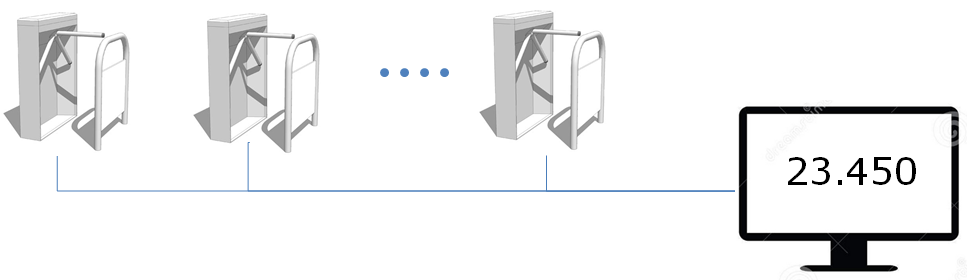

# Thread Programming and Non-blocking Java Servers

### General part

Explain about Thread Programming including:
- When and why we will use Threads in our programs?
- Explain about the Race Condition Problem and ways to solve it in
    Java
- Explain how we can write reusable non-blocking Java Controls using
    Threads
- Explain about deadlocks, how to detect them and ways to solve the
    Deadlock Problem

Practical part
--------------

In this exercise we will simulate a large football stadium with many turnstiles that each updates a shared counter, for each turn on the turnstile.

The turnstiles should use a Network Connection and TCP to update the shared counter.

*Implement a Java Based server that can handle n-turnstile clients without any lost updates.*

1.  Design a TCP server and a simple protocol where each turnstile initially reports that it is a Turnstile (to distinguish from Monitor-Clients, see next step), its id
(turnstile1-turnstile-n) and then reports an increment for each spectator that passes the turnstile

1.  Identify potential Race Condition Problems and handle
the problem(s).

2.  For this exercise you don’t have to implement the turnstile-clients.
Use a few Telnet Clients to simulate the turnstiles.

3.  Extend the system, so A Monitor-Client can request the current total amount of spectators

4.  Change the example to make it possible to see the count from each turnstile

5.  *If you have time-1: Deploy your server to DigitalOcean and
demonstrate using this remote server*

6.  *If you have time-2: Write a simple client (Swing or Web-based) that can show the total amount of spectators*

**Hints:**

For part-1 (the protocol) it could be as simple as you have to send "things" in this order:
- **TURNSTYLE** (to signal that this client is a turnstile, this is sent only once)
- **T-1** (the id of this turnstyle, this is sent only once)
- **Count** (the value to update the shared counter with, sent as many times a necessary)

Feel free to come up with an alternative protocol.
