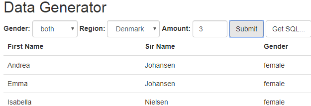
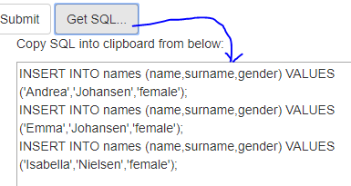
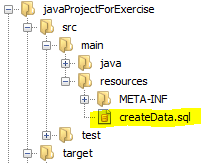

# JavaScript, DOM, JSON, AJAX and JPA


### General part

- Explain about the Document Object Model, and why it’s extremely relevant for modern Web-development
- Explain how JavaScript fit’s into modern Web Development
- Explain (using an example of your own choice) about JavaScript events, and Event Bubbling
- Explain (in words) the purpose of the JavaScript-arrays filter and map methods (also, provide a few examples)
- Explain the topics AJAX and how it has changed the way modern web-applications are created
- Elaborate on how JSON or XML supports communication between subsystems, even when the subsystems are implemented on different platforms.

### CA or Semester Project

For a real exam exercise, this will be a small part where you are
expected to talk, in about 5 minutes, about the semester project or one
of the semester CA’s (related to the topic for this question).

### Practical part start 
(use this [html script](####-script) as your start template)

Design a simple SPA using plain JavaScript, and fetch(for server requests). The application should allow users to create test data representing a person. Initially these data must be presented in a table, but the page must include a “Get SQL ..” button to convert the test data into a valid SQL INSERT Script, presented in the TextArea given in the start template.

**Getting started:** Create a web-project (in whatever way you prefer)
and include the index.html file given above in the project. “Run” the
file in a browser to see the provided layout for the exercise. Observe
script-tag, in the bottom. Create this file (app.js) and place all your
JavaScript in this file.

**1)** You must use this public [*REST
API*](https://github.com/thm/uinames/) to get data for the exercise:

Copy the link below into your browser and test. To get a feeling of how to use the API, try (as a minimum) to: remove *region*, change *gender* to *male*, remove *gender*, change *amount* to 600;

[*http://uinames.com/api/?amount=25&region=denmark&gender=female*](http://uinames.com/api/?amount=25&region=denmark&gender=female)

**2)** Add the necessary code to (using fetch, the API given above, and
DOM-manipulation) render a table as sketched in this figure, when the “Submit” button is pressed:



**2a)** Add a way to present errors for the users (try and request more than 500 names). Hint: Check if the response code is &gt;= 400.

**3)** If not already done, find a way (the simplest and acceptable for this exercise, is a global variable, but feel free to come up with better alternatives) to store the data fetched above, so we can reuse it in it’s original form.

 

**4)** Add the necessary code to convert (when Get SQL is pressed) the
data into valid MySQL syntax that will insert data, into a table with
*matching columns* as sketched in this figure. Insert the generated SQL
into the TextArea provided with the startcode.

*Hint*: You can insert the SQL into the TextArea like this:
`document.getElementById("sql").value = sql;`

*If you have stored the data as requested in 3, and know how to use
**map** and **join**, this should be relatively simple ;-)*

**5)** Using the generated SQL-script

This steps assumes step 1-4 is complete (if not see hints at the
bottom). Now lets create a JPA-application with an Entity class, which
rows are populated from the script you get from step-4.

Create a new plain Java Maven project. In this project create an Entity
Class with properties matching those inserted into the script created in step4.

**6)** In this project, create a file createData.sql in *the exact location* as
sketched in this figure:




- Paste the Script, generated via the feature implemented in step-4, into this script.

- Add this line to your persistence.xml file (set the file to
drop-and-create):

`<property name="javax.persistence.sql-load-script-source"
value="createData.sql">`

- Create the schema, for example by executing:  
`Persistence.generateSchema("YOUR-PU-NAME", null);`

- Verify that data is inserted into the table, either by executing a select all, up against the database or, better, by creating a JPQL-Query that will fetch all data

*Hint: If you had problems with step-4, you can Create the script manually, with just a few names, and use that script for these steps.
When/if this works, go back to step-4, and use this working script as
template for what you have to create.*

#### script
Start template for this exercise:
```html
<!--
Start Code For the Exercise JavaScript, DOM, JSON, AJAX and JPA
-->
<!DOCTYPE html>
<html>
  <head>
    <title>Exam Preparation</title>
    <meta charset="UTF-8">
    <meta name="viewport" content="width=device-width, initial-scale=1, shrink-to-fit=no">
    
    <link rel="stylesheet" href="https://maxcdn.bootstrapcdn.com/bootstrap/3.3.7/css/bootstrap.min.css">
    
    <!-- CDN Polyfills which should allow you to use fetch (and promises) from IE and older browsers -->
    <script src="https://cdnjs.cloudflare.com/ajax/libs/es6-promise/4.1.1/es6-promise.auto.js"></script>
    <script src="https://cdnjs.cloudflare.com/ajax/libs/fetch/2.0.3/fetch.min.js"></script>
  </head>
  <body class="container">
    <H2>Data Generator</h2>
    <div class="form-inline">
      <div class="form-group">
        <label for="gender"> Gender: </label>
        <select id="gender" class="form-control"  >
          <option>both</option>
          <option>male</option>
          <option>female</option>
        </select>
      </div>
      <div class="form-group">
        <label for="region"> Region: </label>
        <select id="region"  class="form-control">
          <option>All</option>
          <option>Denmark</option>
          <option>Germany</option>
          <option>England</option>
          <option>Hungary</option>
        </select>
      </div>
      <div class="form-group">
        <label> Amount:&nbsp; </label><input style="width: 5em;" class="form-control" type="number" id="amount" value="4"> 
      </div>
      <button class="btn btn-default" id="btnsend"> Submit </button>
      <button class="btn btn-default" id="btnsql"> Get SQL... </button>
      <br/>
      <div class="row">
        <div class="col-md-6">
          
          <table id="tbl" class="table">
            <thead>
            <th>First Name</th><th>Surname</th><th>Gender</th>
            </thead>
            <!-- >TODO: Dynamically create the rows with data fetched from the API, and insert into the table here -->
            <tbody id="tblbody"></tbody>
          </table>
        </div>
        <div class="col-md-6">
          <p>Copy SQL into clipboard from below:</p>
          <!-- TODO: Create the necessary SQL-script to insert all data fetched from the API, into a table with matching colums -->
          <textarea readonly id="sql" style="width: 100%" rows="6"></textarea>
          
        </div>
      </div>
    </div>

  </body>
  <!-- >TODO: Create this file and place all your JavaScript here -->
  <script  src="app.js"></script>
</html>

```