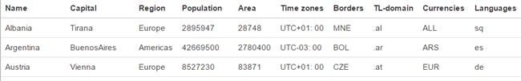
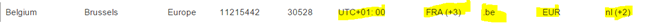

# React, State and Fetch

### General part

-   Describe the term Single Page Application and why it has become so
popular for modern web-applications

- Explain the “recommended” React way of passing data into Components (at the top, or at the bottom or..)

- Explain how JavaScript array methods, like filter, map and (reduce)
can be used to generate dynamic HTML structures (tables,ul's etc.)

- Explain about the Observer pattern, and where you have used it, both with Java and JavaScript.

### Practical part

Getting Started: Clone this project:
[Here](https://github.com/Dat3SemStartCode/exprep_react_fetch.git)

- Type **npm install*** to fetch dependencies and ***npm start** to
execute. Open the project in your favourite IDE.
- In the *root* of the project, open a new terminal and type **npm run
dataserver.** This will start a simple REST/JSON server, which you
need for this exercise (leave this window open, and let the server run
for the rest of the exercise). The server provides two endpoints which
you need for the exercise (test in a browser):
[*http://localhost:3333/labels*](http://localhost:3333/labels)  (Use this endpoint to generate the table headers for this exercise)
[*http://localhost:3333/countries*](http://localhost:3333/countries) (Use this endpoint to generate table data for this exercise).

The project is *a create-react-app* generated project. It simulates a
site that can show country-information (Use the endpoints above to get
data).

**1)** Complete the countryFactory class to fetch data (using fetch),
from the REST-API given above

**2)** Use your updated countryFactory and “inject” it into relevant
controls so it will be available via props in the CountryTable Control

**3)** Add the necessary code to the CountryTable to render a table as
sketched below.. Initially you should show only the first element for
columns with array-values (*multi value-columns* in the following) as in
the figure below.

  
**4)** Change the code that implements a table-row so values with more than one item is rendered with its first value + a string that indicates the number of additional values (hidden values). The figure below should demonstrate this. Belgium e.g. has only one time zone, but has borders to France and three additional countries, it only has one tld (.be), only one currency (EUR) and 3 languages: netherland + two additional languages.

*Hint: Do this first, for only one column. Then refactor relevant code
into a function, used for all multi columns.*

**5)** Change the countryFactory class to include an observer inspired
callback to notify about changes in the *countries* array). Add the
necessary code to other components (where required) to use this callback
and update the GUI when called.

**6)** Use JavaScript’s setInterval function to repeatedly update the
counties array with fresh data from the server (while developing, fetch
every 3 seconds to see changes).

*Data for the DataServer comes from the file server/data.json. While
still watching the table, try to remove some of the countries, or change
values for population, and verify that the UI updates accordingly.*
